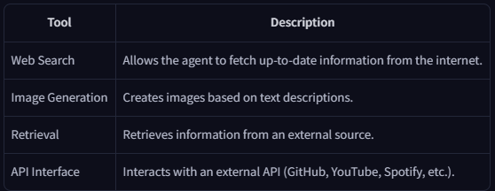
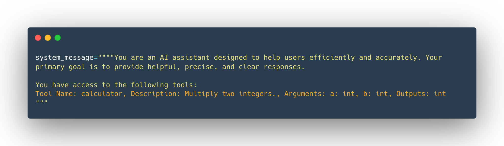
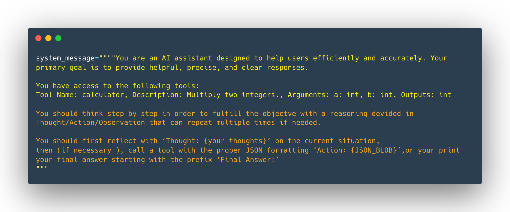

# Agents

> An Agent is a system that leverages an AI model to interact with its environment in order to achieve a user-defined objective. It combines reasoning, planning, and the execution of actions (often via external tools) to fulfill tasks.

### Parts:
1. `Brain (AI Model)` - Handles reasoning and planning. Decides which action to take based on situation
2. `Body (Capabilities and tools)` - what Agent is equipped to do

<br>
<hr>


## LLMs:

> Objective is to predict next token, given sequence of previous tokens


<br>

`token` - unity of information (word or part of a word)

### System Messages (System Prompts)
- Define how model should behave
- Serve as persistent instructions
- Gives information about available tools
- Instuctions to model on how to format actions to take
- Guideline on the thought process segmentation

    <br>
    
    ```json
    system_message = {
        "role": "system",
        "content": "You are a professional customer service agent. Always be polite, clear, and helpful."
    }
    ```

    <br>

### Conversations: User and Assistant (LLM) Messages
> Chat templates maintain context by preserving conversation history

```json
conversation = [
    {"role": "user", "content": "I need help with my order"},
    {"role": "assistant", "content": "I'd be happy to help. Could you provide your order number?"},
    {"role": "user", "content": "It's ORDER-123"},
]
```

### Chat Templates:

Formats exchanges into prompts (SmolLM2 ex.)
```
<|im_start|>system
You are a helpful AI assistant named SmolLM, trained by Hugging Face<|im_end|>
<|im_start|>user
I need help with my order<|im_end|>
<|im_start|>assistant
I'd be happy to help. Could you provide your order number?<|im_end|>
<|im_start|>user
It's ORDER-123<|im_end|>
<|im_start|>assistant
```

- `Base Model` - Trained on raw data to predict next token
- `Instruct Model` - Fine-tuned to follwo instructions and engage in conversations.

<br>

```python
from transformers import AutoTokenizer

tokenizer = AutoTokenizer.from_pretrained("HuggingFaceTB/SmolLM2-1.7B-Instruct")
rendered_prompt = tokenizer.apply_chat_template(messages, tokenize=False, add_generation_prompt=True)
```

<br>
<hr>

## Tools

> Function given to the LLM
1. The agent parses LLM output
2. Recognizes tool Call
3. Invokes tool on LLM behalf
4. Sends tool output to llm for final response

#### Common Tools



#### Tool should contain:
- A textual description of what the function does
- A Callable (something to perform an action)
- Arguments with typings
- (Optional) Outputs with typings


### Creating and passing tools

<details>

<summary>Tool Decorator</summary>

```python
def tool(func):
    """
    A decorator that creates a Tool instance from the given function.
    """
    # Get the function signature
    signature = inspect.signature(func)
    
    # Extract (param_name, param_annotation) pairs for inputs
    arguments = []
    for param in signature.parameters.values():
        annotation_name = (
            param.annotation.__name__ 
            if hasattr(param.annotation, '__name__') 
            else str(param.annotation)
        )
        arguments.append((param.name, annotation_name))
    
    # Determine the return annotation
    return_annotation = signature.return_annotation
    if return_annotation is inspect._empty:
        outputs = "No return annotation"
    else:
        outputs = (
            return_annotation.__name__ 
            if hasattr(return_annotation, '__name__') 
            else str(return_annotation)
        )
    
    # Use the function's docstring as the description (default if None)
    description = func.__doc__ or "No description provided."
    
    # The function name becomes the Tool name
    name = func.__name__
    
    # Return a new Tool instance
    return Tool(
        name=name, 
        description=description, 
        func=func, 
        arguments=arguments, 
        outputs=outputs
    )
```
</details>
<br>

#### Tool example:

```python
@tool
def calculator(a: int, b: int) -> int:
    """Multiply two integers."""
    return a * b

print(calculator.to_string())
```

<br>

> Use .to_string() output in the system prompts



<br>
<hr>

## Thought-Action-Observation

1. `Thought`: The LLM part of the Agent decides what the next step should be.
2. `Action`: The agent takes an action, by calling the tools with the associated arguments.
3. `Observation`: The model reflects on the response from the tool.



1. A user asks : “What’s the weather like in New York today?”
2. `Thought`: The user needs current weather information for New York. I have access to a tool that fetches weather data. 
First, I need to call the weather API to get up-to-date details.”

3. ``Action`: 

    ```json
    {
        "action": "get_weather",
        "action_input": {
        "location": "New York"
        }
    }
    ```
4. `Observation`: Current weather in New York: partly cloudy, 15°C, 60% humidity
5. Repeat cycyle with new information until reaching final answer