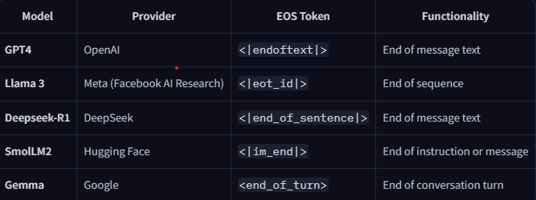

# Agents

> An Agent is a system that leverages an AI model to interact with its environment in order to achieve a user-defined objective. It combines reasoning, planning, and the execution of actions (often via external tools) to fulfill tasks.

### Parts:
1. `Brain (AI Model)` - Handles reasoning and planning. Decides which action to take based on situation
2. `Body (Capabilities and tools)` - what Agent is equipped to do

#### LLMs:

> Objective is to predict next token, given sequence of previous tokens

 

`token` - unity of information (word or part of a word)
