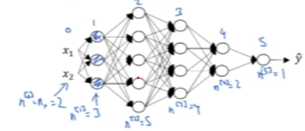

# Deep Learning
[← Back to Main Page](../README.md)

## Table of Contents
- [Notation](notation.md)
- [Basics](#basics)
  - [Logistic Regression](#logistic-regression)
  - [Activation Functions](#activation-functions)
    - [Sigmoid](#simgoid)
    - [Hyperbolic Tangent](#hyberbolic-tangent)
    - [ReLU](#relu-rectified-linear-function)
    - [Leaky ReLU](#leaky-relu)
- [Deep Neural Networks](#deep-neural-networks)

## Basics
###  [Logistic Regression](../supervised_learning/classification/logistic_regression/README.md)
- [Implementation](../supervised_learning/classification/logistic_regression/gradient_decent/gradient_decent.ipynb)

### Activation Functions:

#### Simgoid:
- only use for binary classification output layer

### $$a = \frac{1}{1 + e^{-z}} \rightarrow 0 \ge a \ge 1$$

#### Hyberbolic Tangent
- usually better than sigmoid

### $$a = tahn(z) = \frac{e^{z} - e^{-z}}{e^{z} + e^{-z}} \rightarrow -1 \ge a \ge 1$$

#### ReLu (Rectified Linear function)
- Default (Most common)

### $$ a = max(0, z) $$

#### Leaky ReLu
- Has slight slope before 0, instead of 0 for RELU
- Deals with issue of 0 slope in RELU for training

### $$ a = max(0.01z, z) $$

 

## [Deep Neural Networks](deep_nn/README.md)

 

## [Improving Deep NN]()
### Train/Dev/Test Sets
- Training Set
  - Train algorithms with
- Dev (Cross Validation) Set
  - See which models perform best
- Test Set
  - Unbiased estimate of selected model

### [Bias/Variance](../supervised_learning/supervised_learning.md#bias--variance)
