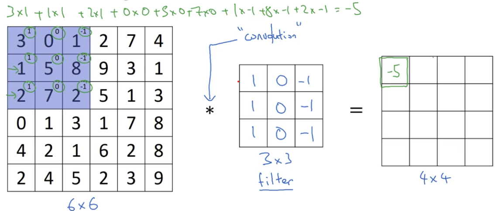
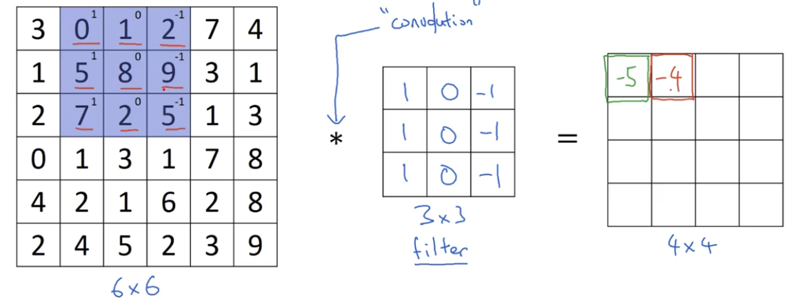
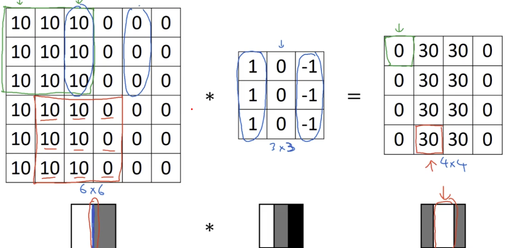
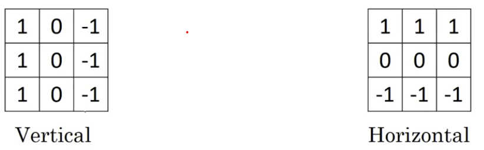
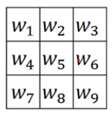
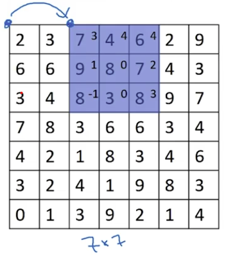
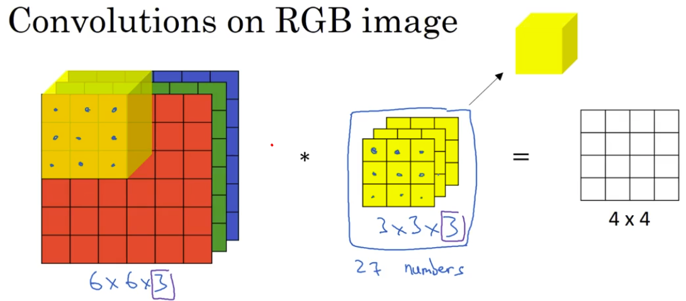

# Convolutional Neural Networks
[← Back to Main Page](../../README.md) | [← Back to Deep Learning](../README.md)

 

## Edge Detection

### Vertical Edge Example:
#### Perform convolution with image and filter:

#### Output will show vertical edges

### Edge Detectors:

> Can set these to be parameters for nn to learn

 

### Padding
> Pad original images with border of 0s 
- Allows corners to be in calculations more than once
- Prevents shrinking of original image size

#### Types:
- Valid: No padding -$ n \times n \ * \ f \times f \rightarrow n-f+1 \times n-f+1$
- Same: Padd so output size same as input -  $p = \frac{f-1}{2}$

### Strided Convolution
> How far you move over when performign convolution

#### Stride of 2 ex.

 

Dimensions: $$ \lfloor\frac{n+2p-f}{s}+1\rfloor \times \lfloor\frac{n+2p-f}{s}+1\rfloor$$

 

### Convolutions on RGB

 

### Single Layer 
> Input: $\Large n^{[l-1]}_H \times n^{[l-1]}_W \times n_c{[l-1]}$
- $\large f^{[l]}$ = filter size
- $\large p^{[l]}$ = padding 
- $\large s^{[l]}$ = stride
- $\large n^{[l]}_c$ = number of filters
- Each filter = $\large f^{[l]} \times f^{[l]} \times n^{[l-1]}_c$
- bias = (1,1,1,$\large n^{[l]}_c$)

 

> Output: $\Large n^{[l]}_H \times n^{[l]}_W \times n_c{[l]}$

$$\Large n^{[l]}_H = \lfloor \frac{n^{[l]}_h + 2p^{[l]} - f^{[l]}}{s^{[l]}} + 1 \rfloor $$
$$\Large n^{[l]}_W = \lfloor \frac{n^{[l]}_W + 2p^{[l]} - f^{[l]}}{s^{[l]}} + 1 \rfloor $$

#### Activations:
$$\Large a^{[l]} \rightarrow n^{[l]}_H \times n^{[l]}_W \times n_c{[l]}$$
$$\Large A^{[l]} \rightarrow m \times n^{[l]}_H \times n^{[l]}_W \times n_c{[l]}$$

#### Weights:
$$ \Large f^{[l]} \times f^{[l]} \times n^{[l-1]}_c \times n^{[l]}_c$$

