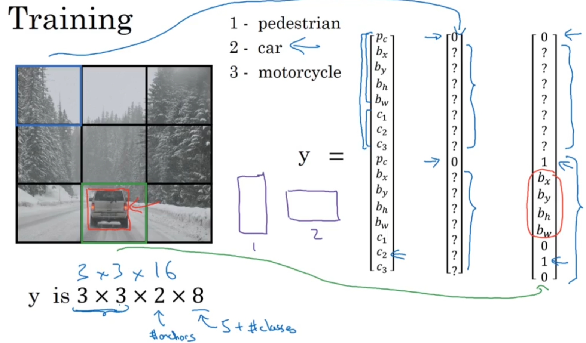
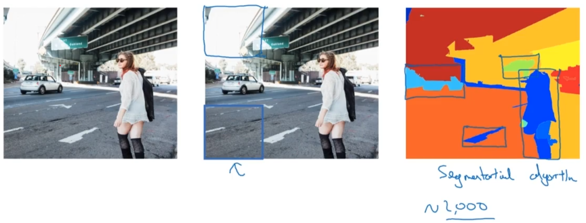

# Localization and Detection
[← Back to Main Page](../../../README.md) | [← Back to CNN](../README.md)

## Algorithms
- YOLO

    

- R-CNN - Region proposals

    
- Fast R-CNN - Use conv sliding windows to classify proposed regions
- Faster R-CNN - Use conv to propose regions
- Semantic Segmentation - labels each pixel of classification 

    

## Transpose Convolution
