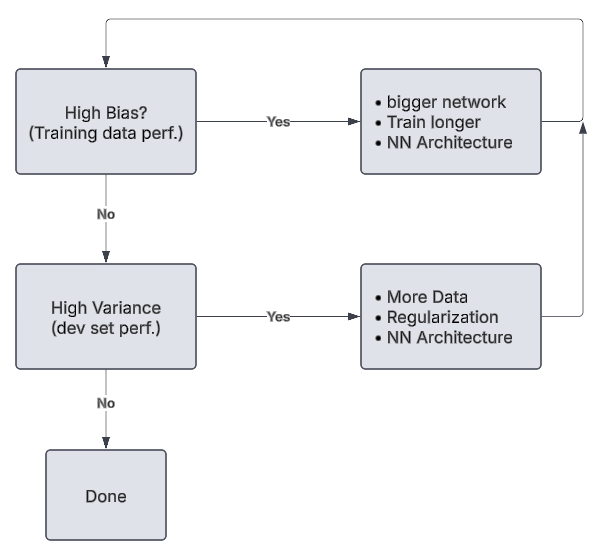

# Improving Deep Neural Networks
[← Back to Main Page](../../README.md) | [← Back to Deep Learning](../README.md)

## Table of Contents
- [Steps](#steps)
- [Regularization](#regularization)
  - [Frobenius Norm or L2 (Weight Decay)](#frobenius-norm-or-l2-weight-decay)
  - [Drop-out Regularization](#drop-out-regularization)
  - [Other Methods](#other-methods)
- [Normalizing Inputs](#normalizing-inputs)
- [Weight Initialization](#weight-initialization)
  - [He Initialization (Best for ReLU)](#he-initialization-best-for-relu)
- [Gradient Checking](#gradient-checking)
  - [Steps](#steps-1)
- [Optimization Algorithms](#optimization-algorithms)
  - [Mini-batch Gradient Decent](#mini-batch-gradient-decent)
  - [Exponentially Weighted Averages](#exponentially-weighted-averages)
  - [Gradient descent with momentum](#gradient-descent-with-momentum)
  - [RMSprop](#rmsprop-root-mean-squared-prop)
  - [Adam](#adam-adaptive-moment-estimation)
  - [Learning Rate Decay](#learning-rate-decay)

## Steps:

 

## [Regularization](regularization/Regularization.ipynb) 
### Frobenius Norm or L2 (Weight Decay)
$$ \Large J(W^{[1]}, b^{[1]},...,W^{[L]}, b^{[L]}) = \frac{1}{m} \sum\limits^{m}_{i=1}\mathcal{L}(\hat{y}^{(i)},y^{(i)}) + 
\frac{\lambda}{2m} \sum \limits^{L}_{l=1} \ \lVert W^{[l]}\rVert^2_F \\[1 em]
\lVert W^{[l]}\rVert^2_F = \sum \limits^{n^{[l]}}_{i=1}\sum \limits^{n^{[l-1]}}_{j=1}(W_{ij}^{[l]})^2 \\[1 em]
W:(n^{[l]},n^{[l-1]}) 
$$

#### Gradient Decent:
$$ \Large dW^{[l]} = \frac{1}{m} dZ^{[l]} \cdot A^{[l-1]T} + \frac{\lambda}{m}W^{[l]}  \\[1 em]
W^{[l]} = W^{[l]} - \alpha dW^{[l]} $$

 

### Drop-out Regularization
> Randomly eliminates nodes each training example \
> \* Do not use at test time

#### Drop out vector (Inverted dropout)
$$\large d\ell = \text{np.random.rand(}a\ell \text{.shape[0], }a\ell\text{.shape[1] < keep\_prob } \\[.5 em]
a\ell = \text{np.multiply(}a\ell, d\ell) \quad\quad \# \ a\ell \ *= d\ell \\[.5 em]
a\ell \ /= \text{ keep\_prob} \\[.5 em]
Z^{[\ell]} = W^{[\ell]} \cdot a^{[\ell]} + b^{[\ell]}
$$

 

$$ \text{Notation:} $$
$$\begin{aligned} 
\ell \quad \text{ = }& \quad \text{layer} \\
\text{keep\_prob}\quad \text{ = }& \quad \text{\% of nodes to keep (ex. 0.8, keep 80\%0} \end{aligned}$$

#### Intuition: Can't rely on any one feature. 
- Have to spread weights

 

### Other Methods
- distort/transform images (increases data to aid against overfitting)

 

## [Normalizing Inputs](../../supervised_learning/regression/linear_regression/feature_scaling/README.md)

$$\Large X = \frac{X -\mu}{\sigma} $$

 

## [Weight Initialization](weight_init/Initialization.ipynb)
> To aid in gradient decent and address vanishing/exploding gradients

### He Initialization (Best for ReLU):
#### Set Var(W) = $\frac{2}{n}$

$$ \Large W^{[\ell]}  = \text{np.random.randn(shape) } * \text{np.sqrt(} \frac{2}{n^{[\ell-1]}}) $$

 

## [Gradient Checking](gradient_checking/Gradient_Checking.ipynb)
> Verify backpropagation

$$ \frac{\partial J}{\partial \theta} = \lim_{\varepsilon \to 0} \frac{J(\theta + \varepsilon) - J(\theta - \varepsilon)}{2 \varepsilon}$$

### Steps:
1. First compute "gradapprox":
    1. $\theta^{+} = \theta + \varepsilon$
    2. $\theta^{-} = \theta - \varepsilon$
    3. $J^{+} = J(\theta^{+}$ = forward_propagation_n(X, Y, vector_to_dictionary(theta_plus))   
    4. $J^{-} = J(\theta^{-})$ = forward_propagation_n(X, Y, vector_to_dictionary(theta_minus))
    5. $gradapprox = \frac{J^{+} - J^{-}}{2  \varepsilon}$
2. Compute the gradient using backward propagation, and store the result in a variable "grad"
3. Compute relative difference 
$$ difference = \frac {\| grad - gradapprox \|_2}{\| grad \|_2 + \| gradapprox \|_2 }$$

 

## [Optimization Algorithms](optimization_algo/README.md)

### [Mini-batch Gradient Decent](optimization_algo/README.md#mini-batch-gradient-decent)
> Split training set into smaller batches

$$ \Large \underset{(n_x, m)}X = \underbrace{[x^{[1]}, x^{[2]}, ..., x^{[1000]}]}_{X^{[1]}}  \
\underbrace{[x^{[1001]}, ..., x^{[2000]}]}_{X^{[2]}}  \
\underbrace{[..., x^{[m]}]}_{X^{[5000]}} 
$$

### [Exponentially Weighted Averages](optimization_algo/README.md#exponentially-weighted-averages)
> Average over # of values for noisy data

$$ {\Large V_t = \beta V_{t-1} + (1-\beta)\theta_t }\\[1.5 em] $$

### [Gradient descent with momentum](optimization_algo/README.md#gradient-descent-with-momentum)
> For very elliptical cost function

### [RMSprop (Root Mean Squared prop)](optimization_algo/README.md#rmsprop-root-mean-squared-prop)

### [Adam (ADAptive Moment estimation)](optimization_algo/README.md#adam-adaptive-moment-estimation)

### [Learning Rate Decay](optimization_algo/README.md#learning-rate-decay)

 

