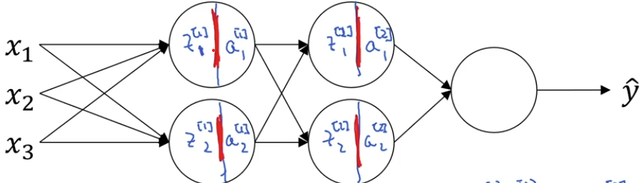

# Batch Normalization
[← Back to Main Page](../../../README.md) | [← Back to Improving Deep NN](../README.md)

> Normalize activations as well as inputs
- Allows faster training of next layer W,b

### For each layer:

$$\large \mu = \frac{1}{m} \sum\limits_i^m Z^{(i)} \\[1 em]
\sigma^2 = \frac{1}{m} \sum\limits_i^m \frac{(Z^{(i)} - \mu)}{\sqrt{\sigma^2 + \epsilon}} \\[1 em]
Z^{(i)}_{norm} = \frac{Z^{(i)} - \mu}{\sqrt{\sigma^2 + \epsilon}} \\[1 em]
\tilde{Z}^{(i)} = \gamma Z^{(i)}_{norm} + \beta \\[1 em]
 \gamma, \beta - \text{ learnable parameters}
$$

 

## Adding Batch Norm to a network

