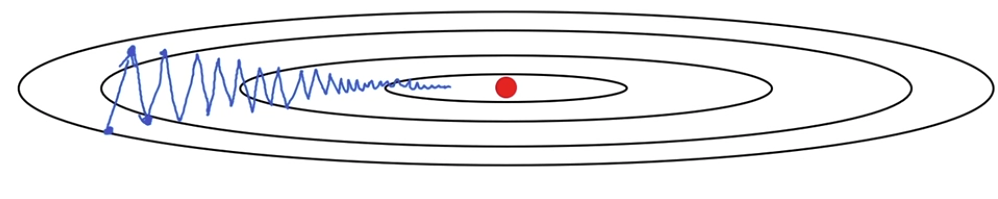

# Optimization Algorithms

[← Back to Main Page](../../../README.md) | [← Back to Improving Deep Learning](../README.md)

## Table of Contents
- [Mini-batch Gradient Decent](#mini-batch-gradient-decent)
  - [Mini-batch Size](#mini-batch-size)
    - [Choose Size](#choose-size)
- [Exponentially Weighted Averages](#exponentially-weighted-averages)
  - [Bias Correction](#bias-correction)
- [Gradient descent with momentum](#gradient-descent-with-momentum)
  - [Steps](#steps)
  - [Hyperparameters](#hyperparameters)
- [RMSprop (Root Mean Squared prop)](#rmsprop-root-mean-squared-prop)
  - [Hyperparameters](#hyperparameters-1)
- [Adam (ADAptive Moment estimation)](#adam-adaptive-moment-estimation)
  - [Hyperparameters](#hyperparameters-2)
- [Learning Rate Decay](#learning-rate-decay)
  - [Implementing](#implementing)
  - [Exponential decay](#exponential-decay)

## Mini-batch Gradient Decent
> Split training set into smaller batches

$$ \Large \underset{(n_x, m)}X = \underbrace{[x^{[1]}, x^{[2]}, ..., x^{[1000]}]}_{X^{[1]}}  \
\underbrace{[x^{[1001]}, ..., x^{[2000]}]}_{X^{[2]}}  \
\underbrace{[..., x^{[m]}]}_{X^{[5000]}} 
$$
- Split Y the same as you split X

$$ \text{Mini-batch t: } X^{[t]}, Y^{[t]} $$

### Mini-batch Size
- If mini-batch size = m : Batch gradient decent
    - Too long per iteration
- If mini-batch size = 1 : Stochastic gradient decent. 
    - Lose speed gained from vectorization
- In practice between 1 & m
    - Fastest learning
    - Make progress without waiting for entire training set

#### Choose Size:
- Small training set: Use batch gradient decent
- Typical mini-batch size: Powers of 2 (64, 128, 256, ... 1024)
- Ensure size fits in CPU/GPU memory

 

## Exponentially Weighted Averages
> Average over # of values for noisy data

$$ {\Large V_t = \beta V_{t-1} + (1-\beta)\theta_t }\\[1.5 em]

\large
\beta = \text{weight} \\[.5 em]
V_{t-1} = \text{previous value} \\[.5 em]
\theta = \text{current value} \\[.5 em]
V_t \approx \text{average over } \frac{1}{1 - \beta} \text{ values}
$$

### Bias Correction
> To compensate for bias introduced early in data where no data points are prior

#### Calculate $V_t$ as above and perform following:

$$ \Large \frac{V_t}{1 - \beta^t} $$ 

- As t grows $1 - \beta^t \rightarrow 1$
- limits bias effect later on in data

 

## Gradient descent with momentum
> For very elliptical cost function

### Steps
- compute dw, db on current mini-batch
- $VdW = \beta VdW + (1-\beta)dW$
- $Vdb = \beta Vdb + (1 - \beta)db$
- $ W = W - \alpha VdW$
- $ b = b - \alpha Vdb$

### Hyperparameters
- $\alpha$ = learning rate
- $\beta$ = exponentially weighted average (usually 0.9)

 

## RMSprop (Root Mean Squared prop)
- compute dw, db on current mini-batch
- $Sdw = \beta SdW + (1-\beta)dW^2$
- $Sdb = \beta Sdb + (1 - \beta)db^@$
- $ W = W - \alpha \frac{dS}{\sqrt{SdW + \epsilon}}$
- $ b = b - \alpha \frac{db}{\sqrt{Sdb + \epsilon}}$

### Hyperparameters:
- $\epsilon$ = Prevents dividing by 0
    - set to $10^{-8}$

 

## Adam (ADAptive Moment estimation)
> Combination of RMSprop & Momentum

- Initialize $ Vdw = 0, Sdw = 0, Vdb = 0, Sdb = 0$
- iteration t:
    - Compute dW, db using current mini-batch
    - $ VdW = \beta_1 VdW + (1-\beta_1)dW, \ Vdb = \beta_1 Vdb + (1-\beta_1)db $
    - $ SdW = \beta_2 SdW + (1-\beta_2)dW^2, \ Sdb = \beta_2 Sdb + (1-\beta_2)db^2 \\[1 em]$
    - $\Large V^{\text{corrected}}dW = \frac{VdW}{1-\beta_1^t}, \ V^{\text{corrected}}db = \frac{Vdb}{1-\beta_1^t} \\[1 em]$
    - $\Large S^{\text{corrected}}dW = \frac{SdW}{1-\beta_2^t}, \ S^{\text{corrected}}db = \frac{Sdb}{1-\beta_2^t} \\[1em]$
    - $\Large W = W - \alpha \frac{V^{\text{corrected}}dW}{\sqrt{S^{\text{corrected}}dW} + \epsilon}, \ b = b - \alpha \frac{V^{\text{corrected}}db}{\sqrt{S^{\text{corrected}}db} + \epsilon} $

### Hyperparameters:
- $\alpha$ : Needs to be tuned
- $\beta_1$: 0.9 ($dW$)
- $\beta_2$: 0.999 ($dW^2$)
- $\epsilon: 10^{-8} $

 

## Learning Rate Decay
> Slowly reduces learning rate $\alpha$

### Implementing
- 1 epoch = 1 pass through entire training data set (all batches in mini-batch)
- $\Large \alpha = \frac{1}{1 + \text{ decay-rate * epoch-num}}\alpha_0 $, where $\alpha_0$ is initial alpha

### Exponential decay
- $ \alpha = 0.95^{\text{epoch-num}}\alpha_0 $