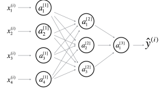
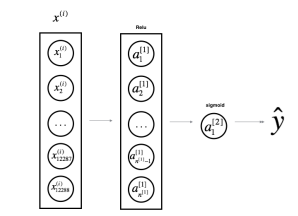

[← Back to Main Page](../README.md) | [← Back to Overview](README.md)

# Standard Notations for Deep Learning

This document discusses a new standard for deep learning mathematical notations.

---

## 1. Neural Networks Notations

### General Comments
- **Superscript $(i)$:** Denotes the *i*th training example.
- **Superscript $[l]$:** Denotes the *l*th layer.

### Sizes
- **$m$:** Number of examples in the dataset.
- **$n_x$:** Input size.
- **$n_y$:** Output size (or number of classes).
- **$n_h^{[l]}$:** Number of hidden units of the *l*th layer.
  - In a for loop, it is possible to denote $n_x = n_h^{[0]}$ and $n_y = n_h$ (number of layers + 1).
- **$L$:** Number of layers in the network.

### Objects
- **$X \in \mathbb{R}^{n_x \times m}$:** The input matrix.
- **$x^{(i)} \in \mathbb{R}^{n_x}$:** The *i*th example represented as a column vector.
- **$Y \in \mathbb{R}^{n_y \times m}$:** The label matrix.
- **$y^{(i)} \in \mathbb{R}^{n_y}$:** The output label for the *i*th example.
- **$W^{[l]} \in \mathbb{R}^{\text{number of units in next layer} \times \text{number of units in previous layer}}$:** The weight matrix. The superscript $[l]$ indicates the layer.
- **$b^{[l]} \in \mathbb{R}^{\text{number of units in next layer}}$:** The bias vector in the *l*th layer.
- **$\hat{y} \in \mathbb{R}^{n_y}$:** The predicted output vector. It can also be denoted as $a^{[L]}$ where $L$ is the number of layers in the network.

### Common Forward Propagation Equations

- **Example 1:**
  $$
  a = g^{[l]}(Wx^{(i)} + b_1) = g^{[l]}(z_1)
  $$
  where $g^{[l]}$ denotes the *l*th layer activation function.

- **Example 2:**
  $$
  \hat{y}^{(i)} = \text{softmax}(Whh + b_2)
  $$

- **General Activation Formula:**
  $$
  a_j^{[l]} = g^{[l]}\left(\sum_k w_{jk}^{[l]} \, a_k^{[l-1]} + b_j^{[l]}\right) = g^{[l]}(z_j^{[l]})
  $$

- **Cost Function Notation:**
  $$
  J(x, W, b, y) \quad \text{or} \quad J(\hat{y}, y)
  $$

#### Examples of Cost Functions

- **Cross-Entropy Cost:**
  $$
  J_{CE}(\hat{y}, y) = - \sum_{i=0}^{m} y^{(i)} \log \hat{y}^{(i)}
  $$

- **$L_1$ Cost:**
  $$
  J_1(\hat{y}, y) = \sum_{i=0}^{m} \left| y^{(i)} - \hat{y}^{(i)} \right|
  $$

---

## 2. Deep Learning Representations

### Representations Overview
- **Nodes:** Represent inputs, activations, or outputs.
- **Edges:** Represent weights or biases.

Below are examples of standard deep learning representations:

### Figure 1: Comprehensive Network
> **Representation:** A comprehensive network diagram commonly used for neural networks.  
> **Note:** For better aesthetics, details on the parameters (e.g., $w_{ij}^{[l]}$ and $b_i^{[l]}$) that should appear on the edges are omitted.

 

### Figure 2: Simplified Network
> **Representation:** a simpler representation of a two layer neural
network, both are equivalent
