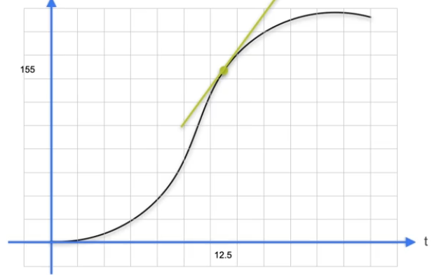

# 📐 Calculus

[← Back to Main Page](../../../README.md) | [← Back to Mathematics](../README.md)

> Quick reference for essential calculus concepts

## 📋 Contents
- [Derivatives](#-derivatives)

## 📊 Derivatives

### $\frac{d}{dx}f(x) $ or $f^{\prime}(x)$

### [Example using sympy](derivatives.ipynb)

> Slope of the tangent line at specific point

### $\frac{\varDelta y}{\varDelta x} $ as $\varDelta \rarr 0$ 

### Maxima & Minima:
- Find point where derivative is 0 

 

### Common Derivatives:

|Rule Name| $f(x)$| $\quad f^{\prime}(x)$|
|---------|-------|----------------------|
||$mx + b$| $\quad m$ |
||$ x^n$ | $\quad nx^{n-1}$|
||Inverse $g(x)$| $\quad g^{\prime}(y) = \frac{1}{f^{\prime}(x)}$|
||$sin(x)$ | $\quad cos(x)$ |
||$cos(x)$ | $\quad -sin(x)$|
|| $e^x$ | $\quad e^x$ |
|| $log(x)$| $\quad \frac{1}{x}$ |
|Scalar| $cf(x)$ |  $\quad cf^{\prime}(x)$ | 
|Sum | $g + h $ | $\quad g^{\prime} + h^{\prime}$ |
|Product| $gh $ | $\quad g^{\prime}h + gh^{\prime}$|
|Chain |$g(h(t))$| $\quad g^{\prime}(h(t)) \cdot h^{\prime}(t)$|

 

### The Square Loss
> Minimize $(x-a_1)^2 + (x-a_2)^2 + ... + (x-a_n)^2$

1. Set derivative = 0 

$$ 
\frac{d}{dx}[(x-a_1)^2 + (x-a_2)^2 + (x-a_3)^2] = 0 \\[2em]

2(x-a) + 2(x - b) + 2(x - c) = 0 \\[2em]

(x-a) + (x-b) + (x-c) = 0 
$$

2. Solve for x

$$
x = \frac{a + b + b}{3}
$$

 

### $$\text{Generally: } x = \frac{a_1 + a_2 + ... + a_n}{n}$$

 

## Partial Derivatives

### $ f(x,y) = x^2 + y^2$

### $ \frac{\partial f}{\partial x} = 2x + 0 \qquad  $  y is treated as a constant

### $ \frac{\partial f}{\partial y} = 0 + 2y \qquad  $  x is treated as a constant

### To find minimum:
1. Set each partial derivative = 0
2. Solnve the set of linear equations
3. determine if critical point is minimum

 

### Gradient Decent

New point = old point - learning rate * slope

### $x_1 = x_0 - \alpha f^{\prime}(x_0)$