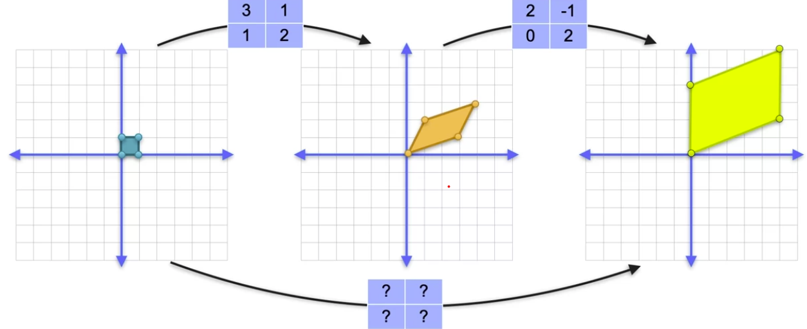

# 📐 Linear Algebra

[← Back to Main Page](../../../README.md) | [← Back to Mathematics](../README.md)

> Quick reference for essential linear algebra concepts

## 📋 Contents
- [Determinants](#-determinants)
  - [2x2 Matrix](#2x2-matrix)
  - [3x3 Matrix](#3x3-matrix)
  - [Properties](#properties)
- [Solving Systems of Equations](#-solving-systems-of-equations)
- [Matrix Rank](#-matrix-rank)
- [Vectors](#-vectors)
  - [Basic Operations](#basic-operations)
  - [Dot Product](#dot-product)
- [Linear Transformations](#linear-transformations)
  - [Matrix Transformations](#matrices-as-linear-transformations)
  - [Finding Transformation Matrix](#linear-transformation-to-matrix)
  - [Combining Transformations](#combining-linear-transformations)
- [Identity Matrix](#the-identity-matrix)
- [Matrix Inverse](#matrix-inverse)

## 📊 Determinants

### 2x2 Matrix
$det(A) = \begin{vmatrix} a & b \\ c & d \end{vmatrix} = ad - bc$

### 3x3 Matrix
$det(A) = \begin{vmatrix} 
a & b & c \\
d & e & f \\
g & h & i
\end{vmatrix} = a\begin{vmatrix}e & f \\ h & i\end{vmatrix} - 
b\begin{vmatrix}d & f \\ g & i\end{vmatrix} + 
c\begin{vmatrix}d & e \\ g & h\end{vmatrix}$

### Properties
- det = 0 → Matrix is singular (no inverse)
- det ≠ 0 → System has unique solution
- |AB| = |A| × |B|

## 🔄 Solving Systems of Equations

### Example: 3x3 System
$\begin{cases}
2x + y + z = 8 \\
x - 3y + z = 2 \\
4x + y - 2z = 4
\end{cases}$

#### Step 1: Write augmented matrix
$\begin{bmatrix}
2 & 1 & 1 & | & 8 \\
1 & -3 & 1 & | & 2 \\
4 & 1 & -2 & | & 4
\end{bmatrix}$

#### Step 2: Convert to row echelon form
1. Divide R1 by 2:
$\begin{bmatrix}
1 & \frac{1}{2} & \frac{1}{2} & | & 4 \\
1 & -3 & 1 & | & 2 \\
4 & 1 & -2 & | & 4
\end{bmatrix}$

2. Eliminate x from other rows:
$\begin{bmatrix}
1 & \frac{1}{2} & \frac{1}{2} & | & 4 \\
0 & -\frac{7}{2} & \frac{1}{2} & | & -2 \\
0 & -1 & -4 & | & -12
\end{bmatrix}$

Continue until solved...

## 📏 Matrix Rank

### Row Echelon Form
```
[1 * * *]
[0 1 * *]
[0 0 1 *]
[0 0 0 0]
```
- Rank = number of non-zero rows
- Full rank = min(rows, cols)
- Rank < min(rows, cols) → dependent system

## 🎯 Vectors

### Basic Operations
- Addition: $\vec{a} + \vec{b} = (a_1+b_1, a_2+b_2)$ <br>

- Subraction (distance between vectors): $\vec{a} - \vec{b} = (a_1-b_1, a_2-b_2)$ <br>

- Scalar multiplication: $c\vec{a} = (ca_1, ca_2)$

### Dot Product
$\vec{a} \cdot \vec{b} = a_1b_1 + a_2b_2$

#### Properties
- $\vec{a} \cdot \vec{b} = 0$ → vectors are orthogonal
- $\vec{a} \cdot \vec{a} = \|\vec{a}\|^2$
- Used in projections and ML algorithms


### Norm of vector
- length of a vector

given vector $\begin{bmatrix}
3 \\
1
\end{bmatrix}$ norm = $\sqrt{3^{2} + 1^{2}}$


<br>

## Linear Transformations

### Matrices as linear transformations


#### Calculating transformation
<br>

```math
\begin{bmatrix}
3 & 1 \\
1 & 2
\end{bmatrix}
\begin{bmatrix}
1 \\
0
\end{bmatrix}
=
\begin{bmatrix}
3 \cdot 1 + 1 \cdot 0 \\
1 \cdot 1 + 2 \cdot 0
\end{bmatrix}
=
\begin{bmatrix}
3 \\
1
\end{bmatrix}
```

<br>

### Linear transformation to matrix


#### Given basis find transformation matrix
(0,0) → (0,0) <br>
(1,0) → (3,-1) <br>
(0,1) → (2,3) <br>
(1,1) → (5,2) 

<br>

use vectors $ \begin{bmatrix}
1 \\ 0
\end{bmatrix} ,  \begin{bmatrix}
0 \\ 1
\end{bmatrix} $ as these form identity matrix $ \begin{bmatrix}
1 & 0 \\
0 & 1 
\end{bmatrix} $

<br>

```math
\begin{bmatrix}
? & ? \\
? & ?
\end{bmatrix}
\begin{bmatrix}
0 \\
1
\end{bmatrix}
=
\begin{bmatrix}
2 \\
3
\end{bmatrix}
\\[2em] 

\begin{bmatrix}
? & ? \\
? & ?
\end{bmatrix}
\begin{bmatrix}
1 \\
0
\end{bmatrix}
=
\begin{bmatrix}
3 \\
-1
\end{bmatrix}

\\[2em]

\begin{bmatrix}
? & ? \\
? & ?
\end{bmatrix}

=

\begin{bmatrix}
3 & 2 \\
-1 & 3
\end{bmatrix}

```

### Combining linear transformations


#### Look at basis vectors:
(1,0) → (5,2) <br>
(0,1) → (0,4)
<br>

```math
\begin{bmatrix}
? & ? \\
? & ?
\end{bmatrix}

=

\begin{bmatrix}
5 & 0 \\
2 & 4
\end{bmatrix}
```

<br>

#### Using matrix multiplication:

<br>


<br>

- A X B - Matrix A must have same # columns as # B rows
- Products matrix with A rows X B columns 
    - ex. 3 x 3 $\cdot$ 3 x 2 = 3 x 2 matrix


<br>

## The identity matrix
- Matrix if multiplied by any other matrix gives the same matrix

```math
\begin{bmatrix}
1 & 0 & 0 & 0 & 0 \\
0 & 1 & 0 & 0 & 0 \\
0 & 0 & 1 & 0 & 0 \\
0 & 0 & 0 & 1 & 0 \\
0 & 0 & 0 & 0 & 1
\end{bmatrix}

\begin{bmatrix}
a\\
b\\
c\\
d\\
e\\
\end{bmatrix}

= 

\begin{bmatrix}
a\\
b\\
c\\
d\\
e\\
\end{bmatrix}
```
<br>

## Matrix inverse

### `Matrices with 0 determinant have no inverse`

#### Product of a matrix and its invere = identity matrix
- Determinant of inverse with be inverse of the determinant of the matrix <br>
<br>

Example: 

Det of $\begin{bmatrix}
3 & 1 \\
1 & 2
\end{bmatrix}$ = 5

Det of inverse $\begin{bmatrix}
0.4 & -0.2 \\
-0.2 & 0.6
\end{bmatrix}$ = $5^{-1}$ = $\frac{1}{5}$

<br>

Because $0^{-1} = ???$, Matrices with Det of 0 have no inverse

<br>


#### To Find:
1. Create system of linear equations from the matrix multiplication
2. Solve as any other system of linear equations

<br>

Example:


<br>

---
💡 _Understanding these concepts is crucial for machine learning algorithms_
