# Probability & Statistics
[← Back to Main Page](../../../README.md) | [← Back to Mathematics](../README.md)

## Table of Contents
- [Intro to Probability](#intro-to-probability)
  - [Rules of Probability](#rules-of-probability)
- [Distributions](#distributions)
  - [Binomial Distribution](#binomial-distribution-discrete-distributions)
  - [Continuous Distribution](#continuous-distribution)
  - [Normal (Gaussian) Distribution](#normal-gaussian-distribution)
- [Visualizations](visualizations.md)

## Intro to probability

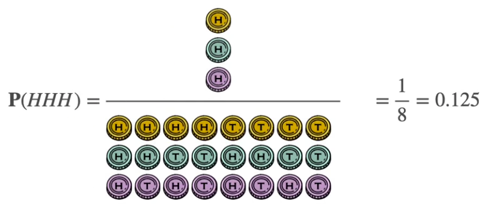

### $ P(event) = \frac{event}{sample \ space} $

 

### Rules of Probability

|Rule| Formula| Notes|
|----|---------|-----|
|Complement | $ P(A^{\prime}) = 1 - P(A)$ | Probability of event not happening|
| Sum (Mutally exclusive)| $P(A \cup B) = P(A) + P(B) $ | Proability of A or B |
| Sum (Non exclusive)| $P(A \cup B) = P(A) + P(B) - P(A \cap B) $ | Proability of A or B - (A & B) |
| Product | $P(A \cap B) = P(A) \cdot P(B) $ | Independent events |
| Conditional | $P(A \cap B) = P(A) \cdot P(B \| A) $| Dependent events |
| Bayes Theorem | $ P(A \| B) = \frac{P(A \cap B)}{P(B)} = \frac{P(A) \cdot P(B \ A)}{P(B)}$   |$P(B) = P(B\|A)P(A) + P(B\|A^{\prime})P(A^{\prime}) $  |

 

## [Distributions](distributions.md)

### Binomial Distribution (Discrete Distributions)

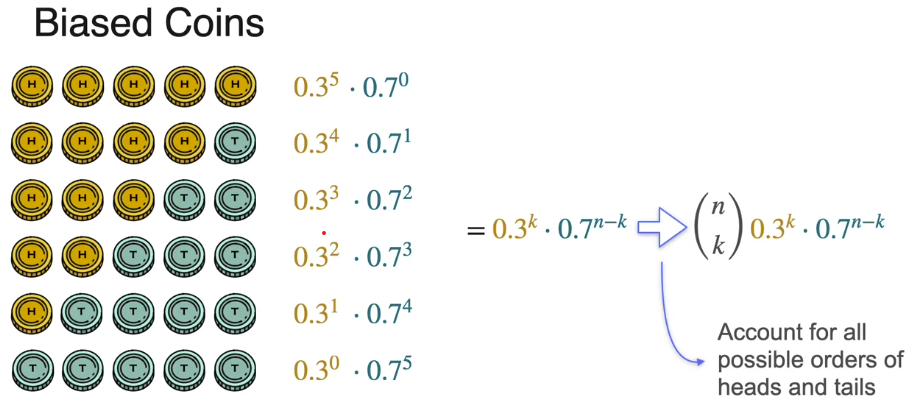

$$\begin{pmatrix} 
n \\
k
\end{pmatrix}  \text{ex. all combinations for landing }k \text{ heads in } n \text { coin tosses}$$ 

#### Event: X = X: X heads in 6 tosses:
### $ \underbrace{\begin{pmatrix}5 \\x\end{pmatrix}}_{\text{All possible orders}}\cdot\overbrace{p^x}^{\text{Prob. of x heads}}\cdot\underbrace{(1-p)^{5-x}}_{\text{Prob. seeing 5-x tails}}$

 

$$\begin{pmatrix} 
n \\
k
\end{pmatrix} n \ choose \ k \ = \frac{n!}{(n-k)!K!}$$ 

$$ \text{Ordered sets of length }k \rightarrow \text{Unordered sets of length }k $$

 

### Continuous Distribution

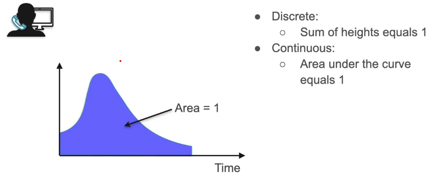

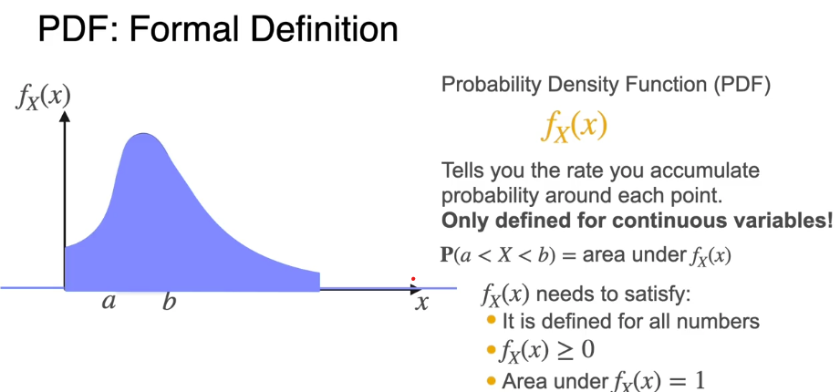

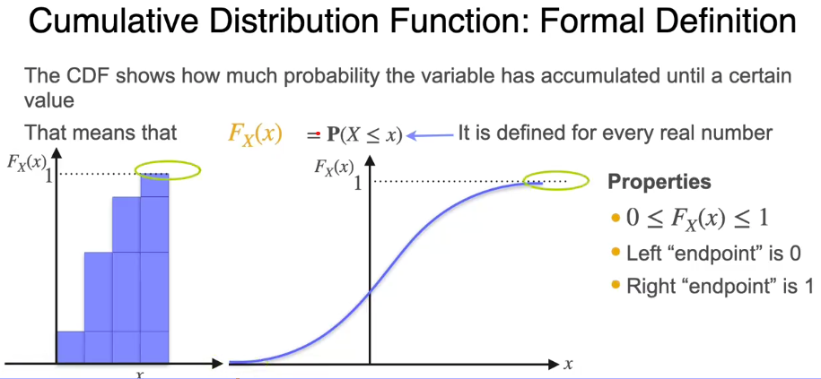

 

### Normal (Gaussian) Distribution

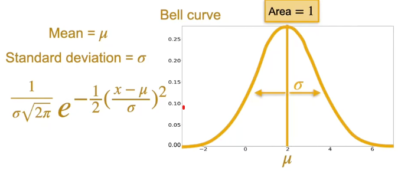

 

## Population and Samples

### Proportion

#### Population Proportion:

### $$ p = \frac{\text{number items with characteristic }(x)}{\text{population }(N)}$$

#### Sample Proportion:

### $$ \hat{p} = \frac{\text{number items with characteristic }(x)}{\text{sample population }(n)}$$

 

### Variance
Population:

### $$ Var(X) = \sigma^2 =  \frac{1}{N}\sum(x - \mu)^2$$ 

Sample: 
### $$ \widehat{Var(X)} = s^2 =  \frac{1}{n - 1}\sum \limits_{i=1}^{n}(x - \bar{x})^2$$ 
> Take average of all sample variances for estimated Var(x)

 

### MLE (Maximum Likelihood Estimation)

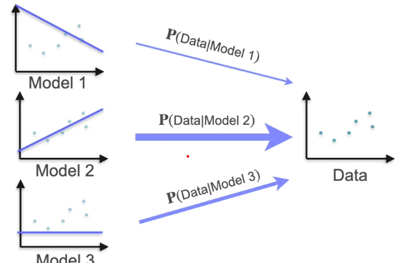

#### Maximize P(Data | Model)

#### Bernoulli:
### $$ \hat{p} = \frac{\sum \limits_{i=1}^{n}x_i}{n} = \bar{x}$$

 

## Bayesian Statistics

| Frequentist | Bayesian |
|-------------|----------|
| Prob represent long term frequency   of events| Probs represent degree of certainty | 
|Concept of likelihood | Concept of prior
| Goal: Find model that most likely   generated the data | Goal: Update prior belief base on   observation |

 

### $$ P(A|B) = \frac{P(B|A)P(A)}{P(B)}  $$

#### Terms:
- $P(A|B) $ = Posterior: Belief A will happen after considering evidence B
- $P(A)$ = Prior: Belief A will happen (before considering evidence B)
- $P(B|A)$ = Likelihood of evidence B appearing, given A happened
- $P(B)$ - Probability of evidence B in any circumstance

 

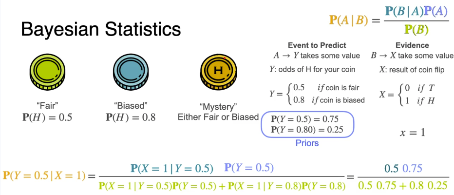

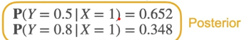

 

#### Formulas:
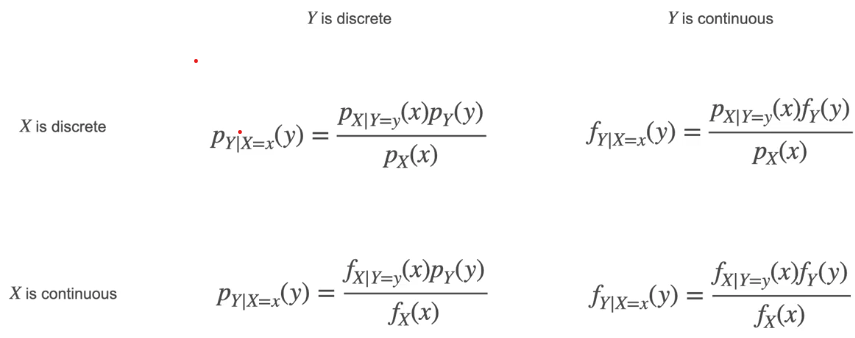

 

## Confidence Intervals

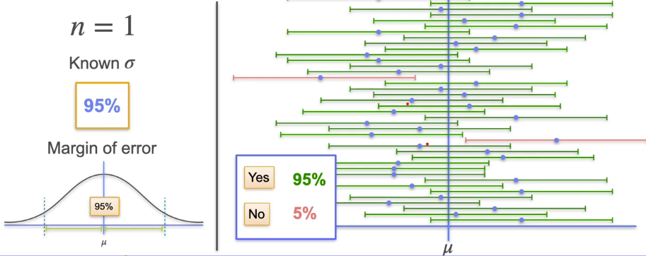>
> Confidence interval of 95% = 95% of confidence intervals with contain $\mu$ (Population mean)