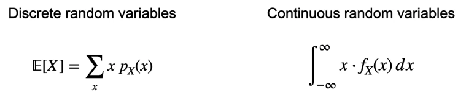

# Distributions
[← Back to Main Page](../../../README.md) | [← Back to Probability & Statistics](README.md)

## Measures

### Mean ( Expected value)



- Mean or balancing point
- weighted average of either PMF or PDF

<br>

### Median 
> Middle number or average of middle numbers (if even number of values)

```python
def median(data_set):
    n = len(data_set)
    if n % 2 == 1:
        return data_set[n // 2]
    else:
        return (data_set[n // 2 - 1] + data_set[n // 2]) / 2
```

<br>

### Mode
> Value(s) with highest probability or frequency

<br>

### Variance
> Measuring spread


<br>

### $$Var(X) = \Epsilon[(X - \Epsilon[X])^2] $$

### $$= \Epsilon[X^2] - \Epsilon[X]^2$$

$$Var(aX + b) = a^2Var(X)$$

1. Find X's mean
2. Find deviation from that mean for every value of X
3. Square those deviations
4. Average those squared deviations