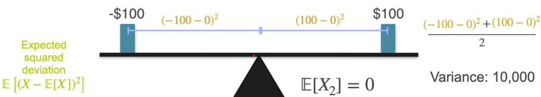

# Distributions
[← Back to Main Page](../../../README.md) | [← Back to Probability & Statistics](README.md)

## Table of Contents
- [Measures](#measures)
  - [Mean](#mean--expected-value)
  - [Median](#median)
  - [Mode](#mode)
  - [Variance](#variance)
  - [Standard Deviation](#standard-deviation-)
  - [Moments of a Distribution](#moments-of-a-distribution)
    - [Skewness](#skewness)
    - [Kurtosis](#kurtosis)
- [Standardizing Distribution](#standardizing-distribution)

## Measures

### Mean ($\mu$) ( Expected value)


- Mean or balancing point
- weighted average of either PMF or PDF

<br>

### Median 
> Middle number or average of middle numbers (if even number of values)

```python
def median(data_set):
    n = len(data_set)
    if n % 2 == 1:
        return data_set[n // 2]
    else:
        return (data_set[n // 2 - 1] + data_set[n // 2]) / 2
```

<br>

### Mode
> Value(s) with highest probability or frequency

<br>

### Variance
> Measuring spread



<br>

### $$Var(X) = \Epsilon[(X - \Epsilon[X])^2] $$

### $$= \Epsilon[(X - \mu)^2] $$

### $$= \Epsilon[X^2] - \Epsilon[X]^2$$

$$Var(aX + b) = a^2Var(X)$$

1. Find X's mean
2. Find deviation from that mean for every value of X
3. Square those deviations
4. Average those squared deviations

<br>

### Standard Deviation ($\sigma$)


### $$ std(x) = \sqrt{Var(x)}$$

#### 68-95-99.7 rule:
- 68% within 1 $\sigma$ of mean
- 95% within 2 $\sigma$
- 99.7% within 3 $\sigma$

<br>

### Moments of a Distribution
> Take value to the power of moment # in expectation calculation


<br>

#### Skewness
> 3rd moment. Shows postive/negative skew

### $$ \text{Skewness }= \Epsilon[(\frac{X-\mu}{\sigma})^3] $$

- Expected value of center and standardized distribution (to 3rd power)


<br>

#### Kurtosis
> The 4th momemt

### $$ \text{Kurtosis }= \Epsilon[(\frac{X-\mu}{\sigma})^4] $$


<br>
<hr>

## Standardizing Distribution
### 1. Center mean 

### $$ X \rightarrow X - \mu$$

### 2. Set standard deviation to 1

### $$ X \rightarrow \frac{X}{\sigma}$$

