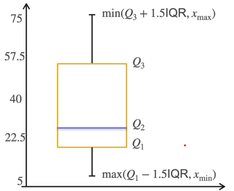

# Visualizations

## Data points
### Quantile
- The k% quantile: Leave k% of data to left and (100-k)% to the right
- Common quantiles (Quartile):
    - 25% (Q1)
    - 50% (Q2)
    - 75% (Q3)

### IQR (InterQuartile Range)
> Where 50% of data lies

### $$ IQR = Q3 - Q1 $$

## Box-plots

### Consist of:
- Median 
- Q1 & Q3
- Min & Max

