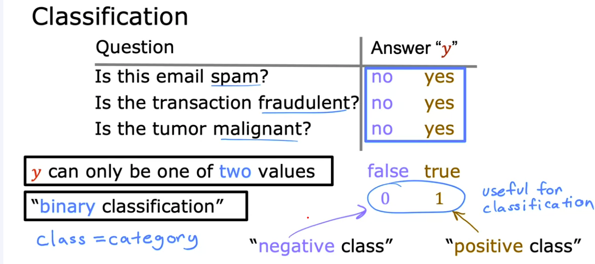
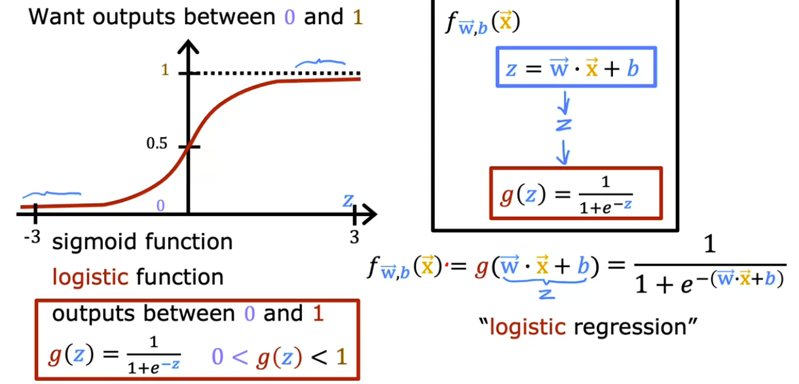
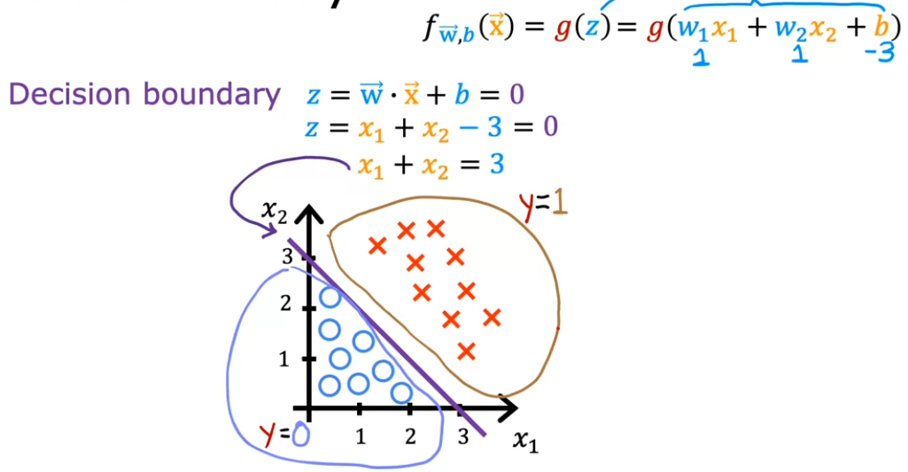
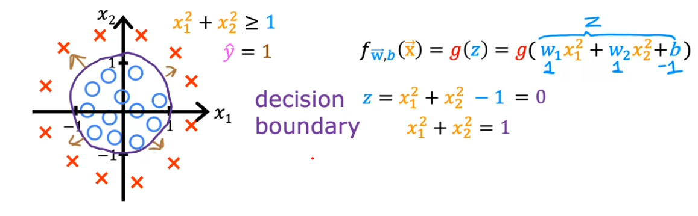

# 📊 Logistic Regression

[← Back to Main Page](../../../README.md) | [← Back to Supervised Learning](../../supervised_learning.md)

> A classification algorithm that predicts discrete categories using probability

## 🔄 Overview

## 📈 [Sigmoid Function](sigmoid_function/sigmoid.ipynb)

> Converts any input into a probability between 0 and 1

### 💡 Key Concepts
- Output represents probability that class is 1
- Function shape ensures output between [0,1]
- Decision boundary at 0.5 probability

## 🎯 Example Application
### Medical Diagnosis
- Input ($x$): tumor size
- Output ($y$):
  - 0: not malignant
  - 1: malignant

#### Probability Interpretation
If $\mathcal{f}_{\vec{w}, b}(\vec{X}) = 0.7$
- 70% chance that $y = 1$ (malignant)
- 30% chance that $y = 0$ (not malignant)

## 📐 Mathematical Framework
$\mathcal{f}_{\vec{w}, b}(\vec{X}) = P(y=1|\vec{X};\vec{w},b)$

> **Interpretation:**
> - Probability that $y$ is 1
> - Given input $\vec{x}$
> - With parameters $\vec{w},b$
> - $P(y = 0) + P(y = 1) = 1$

 

## 🎯 Decision Boundary
> When the model makes classification decisions

### Key Points
- Threshold typically set at 0.5
- Sigmoid function = 0.5 when input = 0

### Decision Rule
$\mathcal{f}_{\vec{w},x}(\vec{x}) \geq 0.5$ → $\hat{y} = 1$ (positive class)  
$\mathcal{f}_{\vec{w},x}(\vec{x}) < 0.5$ → $\hat{y} = 0$ (negative class)

### Mathematical Form
$\mathcal{f}_{\vec{w},x}(\vec{x}) = g(\underbrace{\vec{w} \cdot \vec{x} + b}_{z}) = \frac{1}{1 + e^{-\vec{w} \cdot \vec{x} + b}}$

> **Classification Rules:**
> - When $\vec{w} \cdot \vec{x} + b \geq 0$ → $y = 1$
> - When $\vec{w} \cdot \vec{x} + b < 0$ → $y = 0$

## 📊 Decision Boundary Examples

### Linear Boundary

### Non-Linear Boundary

---
💡 _Logistic regression is fundamental for binary classification problems_