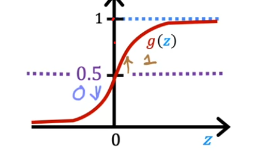

# 📊 Logistic Regression

[← Back to Main Page](../../../README.md) | [← Back to Supervised Learning](../../supervised_learning.md)

> A classification algorithm that predicts discrete categories using probability

## 📋 Contents
- [Overview](#-overview)
- [Sigmoid Function](#-sigmoid-function)
- [Example Application](#-example-application)
- [Mathematical Framework](#-mathematical-framework)
- [Decision Boundary](#-decision-boundary)
  - [Examples](#-decision-boundary-examples)
- [Cost Function](#-cost-function)
  - [Loss Function](#loss-function-definition)
  - [Implementation](#-simplified-implementation-form)
- [Gradient Descent](#-gradient-descent)
- [Implementation Notes](#-implementation-notes)
- [Scikit-learn Implementation](scikit_learn/scikit_learn.ipynb)

## 🔄 Overview

## 📈 [Sigmoid Function](sigmoid_function/sigmoid.ipynb)

> Converts any input into a probability between 0 and 1

### 💡 Key Concepts
- Output represents probability that class is 1
- Function shape ensures output between [0,1]
- Decision boundary at 0.5 probability

## 🎯 Example Application
### Medical Diagnosis
- Input ($x$): tumor size
- Output ($y$):
  - 0: not malignant
  - 1: malignant

#### Probability Interpretation
If $\mathcal{f}_{\vec{w}, b}(\vec{X}) = 0.7$
- 70% chance that $y = 1$ (malignant)
- 30% chance that $y = 0$ (not malignant)

## 📐 Mathematical Framework
$\mathcal{f}_{\vec{w}, b}(\vec{X}) = P(y=1|\vec{X};\vec{w},b)$

> **Interpretation:**
> - Probability that $y$ is 1
> - Given input $\vec{x}$
> - With parameters $\vec{w},b$
> - $P(y = 0) + P(y = 1) = 1$

 

## 🎯 [Decision Boundary](decision_boundary/decision_boundary.ipynb)
> When the model makes classification decisions

### Key Points
- Threshold typically set at 0.5
- Sigmoid function = 0.5 when input = 0

### Decision Rule
$\mathcal{f}_{\vec{w},x}(\vec{x}) \geq 0.5$ → $\hat{y} = 1$ (positive class)  
$\mathcal{f}_{\vec{w},x}(\vec{x}) < 0.5$ → $\hat{y} = 0$ (negative class)

### Mathematical Form
$\mathcal{f}_{\vec{w},x}(\vec{x}) = g(\underbrace{\vec{w} \cdot \vec{x} + b}_{z}) = \frac{1}{1 + e^{-\vec{w} \cdot \vec{x} + b}}$

> **Classification Rules:**
> - When $\vec{w} \cdot \vec{x} + b \geq 0$ → $y = 1$
> - When $\vec{w} \cdot \vec{x} + b < 0$ → $y = 0$

## 📊 Decision Boundary Examples

### Linear Boundary

### Non-Linear Boundary

 

## 📉 [Cost Function](cost_function/cost_function.ipynb)
> Measures how well the model's predictions match the actual values

### [Loss Function](cost_function/loss_function.ipynb) Definition
$L(\mathcal{f}_{\vec{w},b}(\vec{x}^{(i)}), \vec{y}^{(i)}) = \begin{cases}
-log({f}_{\vec{w},b}(\vec{x}^{(i)})) & \text{if } y^{(i)} = 1 \\
-log(1 - {f}_{\vec{w},b}(\vec{x}^{(i)})) & \text{if } y^{(i)} = 0
\end{cases}$

### Loss Visualization

#### When y = 1
> Higher loss when prediction is closer to 0

#### When y = 0
> Higher loss when prediction is closer to 1

### 💡 Simplified Implementation Form
> Single equation that works for both y=0 and y=1 cases

$$loss(f_{\mathbf{w},b}(\mathbf{x}^{(i)}), y^{(i)}) = -y^{(i)} \log(f_{\mathbf{w},b}(\mathbf{x}^{(i)})) - (1 - y^{(i)}) \log(1 - f_{\mathbf{w},b}(\mathbf{x}^{(i)}))$$

### Case Analysis

#### When y = 0
> Right term remains, left term becomes zero
$$\begin{align}
loss(f_{\mathbf{w},b}(\mathbf{x}^{(i)}), 0) &= -(0) \log(f_{\mathbf{w},b}(\mathbf{x}^{(i)})) - (1) \log(1 - f_{\mathbf{w},b}(\mathbf{x}^{(i)})) \\
&= -\log(1 - f_{\mathbf{w},b}(\mathbf{x}^{(i)}))
\end{align}$$

#### When y = 1
> Left term remains, right term becomes zero
$$\begin{align}
loss(f_{\mathbf{w},b}(\mathbf{x}^{(i)}), 1) &= -(1) \log(f_{\mathbf{w},b}(\mathbf{x}^{(i)})) - (0) \log(1 - f_{\mathbf{w},b}(\mathbf{x}^{(i)})) \\
&= -\log(f_{\mathbf{w},b}(\mathbf{x}^{(i)}))
\end{align}$$

### 📊 Cost Function Summary
> Total cost across all training examples

### $$ J(\vec{w}, b) = -\frac{1}{m} \sum\limits^{m}_{i=1}[ y^{(i)} \log(f_{\mathbf{\vec{w}},b}(\mathbf{x}^{(i)})) + (1 - y^{(i)}) \log(1 - f_{\mathbf{\vec{w}},b}(\mathbf{\vec{x}}^{(i)}))] $$

### $$ \text{Where:  }f_{\mathbf{w},b}(\mathbf{x}^{(i)}) = \sigma(z)  = \frac{1}{1 + e^{-z}}$$
### $$ \text{and  }z = \vec{w} \cdot \vec{x} + b_{z} $$

## 🔄 [Gradient Descent](gradient_decent/gradient_decent.ipynb)
> Algorithm to minimize cost function

### Update Rules
Repeat until convergence:

#### Weight Update
$w_j = w_j - \alpha[\frac{1}{m} \sum\limits_{i=1}^{m} (\mathcal{f}_{\vec{w},b}(\vec{x}⁽ⁱ⁾)- y⁽ⁱ⁾)x_j^{(i)}]$

#### Bias Update
$b = b - \alpha[\frac{1}{m} \sum\limits_{i=1}^{m} (\mathcal{f}_{\vec{w},b}(\vec{x}⁽ⁱ⁾)- y⁽ⁱ⁾)]$

### Model Function
> Sigmoid function used for predictions

$\mathcal{f}_{\vec{w},b}(\vec{X}) = \frac{1}{1 + e^{-(\vec{w} \cdot \vec{x} + b)}}$

## 🛠️ Implementation Notes
### Feature Scaling & Learning Rate
> Same principles as linear regression apply

- [Feature Scaling Details](../../regression/linear_regression/README.md#feature-scaling)
- [Learning Rate Guide](../../regression/linear_regression/README.md#choosing-learning-rate)

## [Regularization](../../regularization/README.md)

### [Implementation](../../regularization/regularization.ipynb)

### Gradient Descent Update Rules

#### Weight Update
> Including regularization term

## $w_j = w_j - \alpha [\frac{1}{m} \sum\limits^{m}_{i=1}[(\mathcal{f}_{\vec{w},b}(\vec{x}^{(i)}) -y^{(i)}) \ x^{(i)}_{j}] + \frac{\lambda}{m} w_j]$

#### Bias Update
> Bias term is not regularized

## $b = b - \alpha \frac{1}{m} \sum\limits^{m}_{i=1}(\mathcal{f}_{\vec{w},b}(\vec{x}^{(i)}) -y^{(i)})$

---
💡 _Logistic regression is fundamental for binary classification problems_