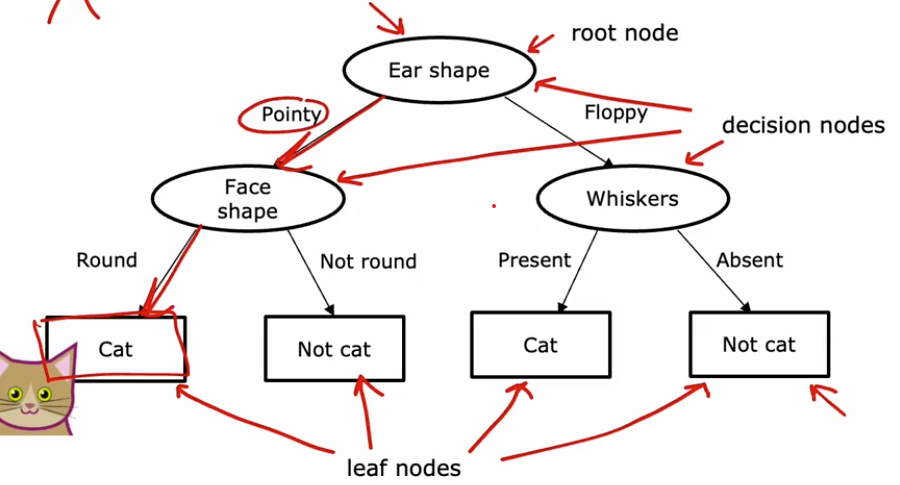
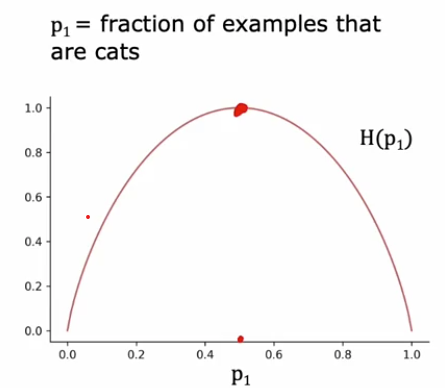
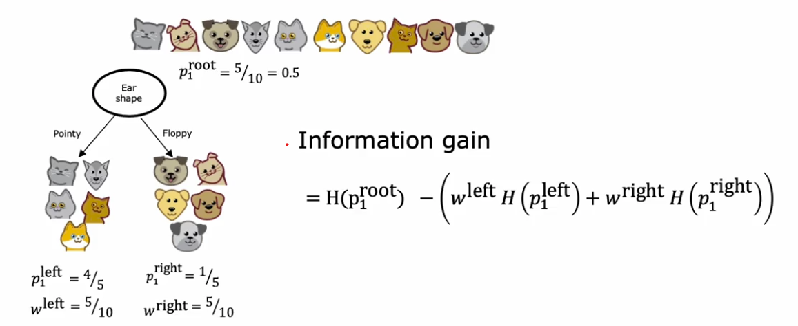
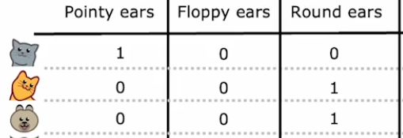

[← Back to Main Page](../../README.md) | [← Back to Supervised Learning](../supervised_learning.md)

# Decision Trees

## Measuring purity

### Entropy as measure of impurity

 

- Highest when examples are 50/50 split
- Lowest when a feature selects either all or none

### Entropy function

- $p_1$ - Fraction of examples that are the classification (cats from the example)
- $p_0 = 1 - p_1$ - Fraction that are not the classification

### $H(p_1) = -p_1log_2(p_1) - p_0log_2(p_0)$
###  $\quad\quad\quad =  -p_1log_2(p_1) - (1 - p_1)log_2(1-p_1)$

 

## Information Gain
- Used for pick most useful features to split on

 

- $p_1^{left}$ - Fraction of examples in left subtree with positive label
- $w^{left}$ - Fraction of all examples in root node that went to the left
- $p_1^{right}$ - Fraction of examples in right subtree with positive label
- $w^{right}$ - Fraction of all examples in root node that went to the right
- $p_1^{root}$ - Fraction of positive examples in root node

### Choosing a feature to split on:
- Calculate for features as root node
- Pick one with highest information gain

 

## One-hot encoding
- encode categorical feature as binary (1 or 0)

    

 