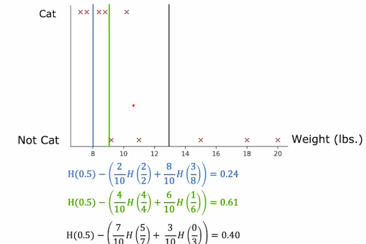
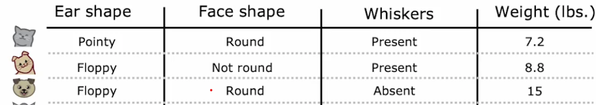
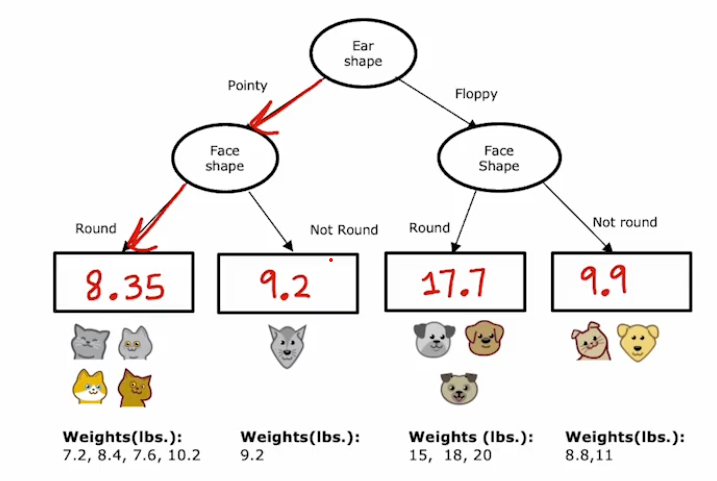
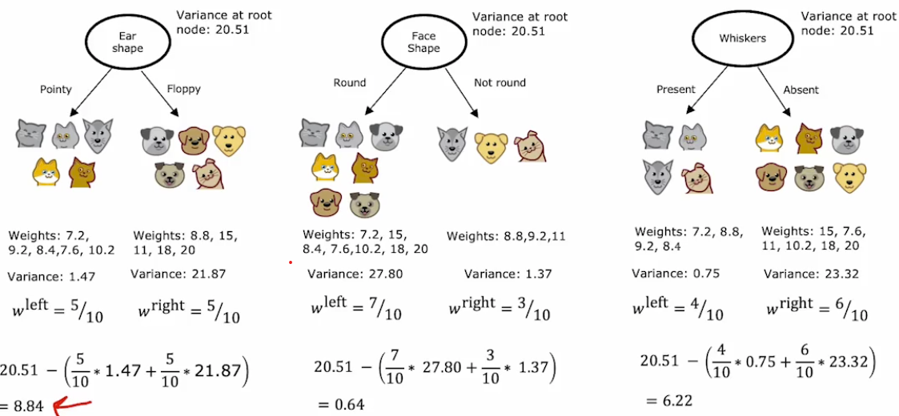
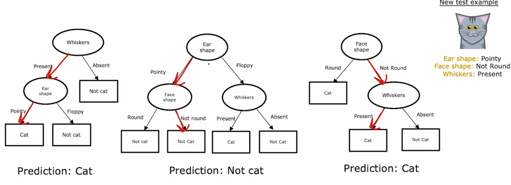

[← Back to Main Page](../../README.md) | [← Back to Supervised Learning](../supervised_learning.md)

# Decision Trees

## Table of Contents
- [Measuring Purity](#measuring-purity)
  - [Entropy as Measure of Impurity](#entropy-as-measure-of-impurity)
  - [Entropy Function](#entropy-function)
- [Information Gain](#information-gain)
- [Feature Handling](#feature-handling)
  - [One-hot Encoding](#one-hot-encoding-of-categorical-features)
  - [Continuous Values](#continuous-valued-features)
- [Regression with Decision Trees](#regression-with-decision-trees-predicting-a-number)
- [Tree Ensembles](#tree-ensembles)
  - [XGBoost](#xgboost-extreme-gradient-boosting)

---

<div align="center">
  
</div>

## Measuring Purity

### Entropy as Measure of Impurity

<div align="center">
  
</div>

- Highest when examples are 50/50 split
- Lowest when a feature selects either all or none

### Entropy Function

- $p_1$ - Fraction of examples that are the classification (cats from the example)
- $p_0 = 1 - p_1$ - Fraction that are not the classification

$$H(p_1) = -p_1log_2(p_1) - p_0log_2(p_0)$$
$$= -p_1log_2(p_1) - (1 - p_1)log_2(1-p_1)$$

## Information Gain
- Used for picking most useful features to split on

<div align="center">
  
</div>

Where:
- $p_1^{left}$ - Fraction of examples in left subtree with positive label
- $w^{left}$ - Fraction of all examples in root node that went to the left
- $p_1^{right}$ - Fraction of examples in right subtree with positive label
- $w^{right}$ - Fraction of all examples in root node that went to the right
- $p_1^{root}$ - Fraction of positive examples in root node

**Feature Selection:**
- Calculate for features as root node
- Pick one with highest information gain

## Feature Handling

### One-hot Encoding of Categorical Features
- Encode categorical feature as binary (1 or 0)

<div align="center">
  
</div>

### Continuous Valued Features
- Calculate information gain for different points
- Split on the one with highest gain

<div align="center">
  
</div>

## Regression with Decision Trees: Predicting a Number

<div align="center">
  
</div>

> Model will assign average of values at leaf node

<div align="center">
  
</div>

**Choosing a Split:**
- Calculate variance at each node
- Choose largest reduction in variance from root

<div align="center">
  
</div>

## Tree Ensembles
> Collection of multiple trees

<div align="center">
  
</div>

- Trees will vote on classification

### XGBoost (eXtreme Gradient Boosting)
- Open source implementation of boosted trees
- Good default splitting and stopping criteria
- Built-in regularization 

**Algorithm Steps** (Given training set size $m$):

for $b = 1$ to $B$:
1. Use sampling with replacement to create a new training set size m 
    - Instead of picking from all examples equally
    - Make it more likely to pick misclassified examples from previously trained trees
2. Train a decision tree on the new dataset

> Focuses next tree on examples that previous tree not doing well on

**Classification Example:**
```python
from xgboost import XGBClassifier

model = XGBClassifier()
model.fit(X_train, y_train)
y_pred = model.predict(X_test)
```

**Regression Example:**
```python
from xgboost import XGBRegressor

model = XGBRegressor()
model.fit(X_train, y_train)
y_pred = model.predict(X_test)
```