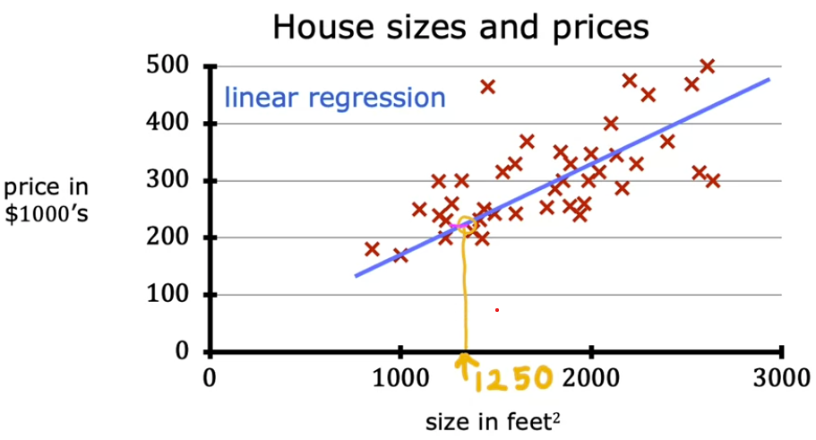
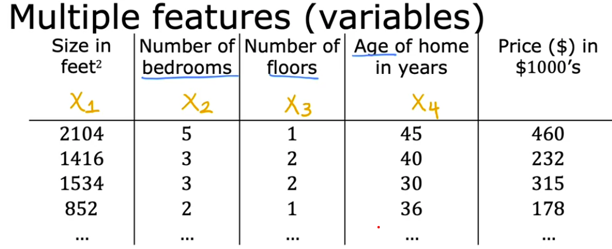

# 📈 Linear Regression

[← Back to Main Page](../../README.md) | [← Back to Supervised Learning](../supervised_learning.md)

> Predicting continuous values using linear relationships

## 📝 Key Concepts
- Model trained on labeled input/output pairs
- Fits a straight line through training data
- Uses fitted line to predict future outcomes

## 🔍 Visual Example



## 💡 Applications
- Housing price prediction
- Sales forecasting
- Consumer behavior analysis

## 📘 Implementation Steps
### Single Variable Linear Regression:

#### 1. [Model Representation](single_variate/1_model_representation.ipynb)
#### Representing 𝑓:

f<sub>w,b</sub>(x) = wx + b
- Determines output `ŷ`
- `w` - Slope of line
- `b` - y-intercept

#### 2. [Cost Function](single_variate/2_cost_function.ipynb)
- <b>Squared Error Cost function</b>: Measures accuracy of predictions
```math
J(w,b) = \frac{1}{2m} \sum_{i=1}^{m} (ŷ⁽ⁱ⁾- y⁽ⁱ⁾)²
```
  - `m` = number of training examples
  - `ŷ⁽ⁱ⁾` = predicted value
  - `y⁽ⁱ⁾` = actual value
- Goal: Minimize J(w,b)

#### 3. [Gradient Decent](single_variate/3_gradient_decent.ipynb)
- Have some cost function <b>J(w,b)</b>, want <b>$\min\limits_{w, b}$ J(w,b)</b>
- Takes down path of steepest decent to local minima

<br>

<b>Formula</b>:

tmp_w = w - $\alpha\;\frac{d}{dw}J(w,b)$ <br>
tmp_b = b - $\alpha\;\frac{d}{db}J(w,b)$ <br>
w = tmp_w <br>
b = tmp_b

<br>

#### Derivative of cost function with respect to w and to b: <br> <br>
 ### $\frac{d}{dw}J(w,b)$ = $\frac{1}{m}\sum\limits_{i=1}^{m}(\mathcal{f}_{w,b}(x^{(i)}-y^{(i)})x^{(i)})$ <br> <br>
 ### $\frac{d}{db}J(w,b)$ = $\frac{1}{m}\sum\limits_{i=1}^{m}(\mathcal{f}_{w,b}(x^{(i)}-y^{(i)}))$ <br> <br> 
- `α` = learning rate
  - if too small - greadient descent will be very slow
  - if too large - can overshoot the minimum and fail to converge (diverge)

`Must simultaneously update w and b `

<br>

### Multiple Linear Regression:

- $x_j$ = $j^{th}$ feature
- n = number of features
- $\vec{x}^{(i)}$ = features of $i^{th}$ training example
- $x_{j}^{(i)}$ = value of feature j in $i^{th}$ training example

#### 1. [Model Representation]()
### $\mathcal{f}_{w,b}(x) = w_1x_1 + w_2x_2 + w_3x_3 ... w_jx_j + b = \vec{w} \cdot \vec{x} + b$


Parameters:
- $\vec{w}$ = $[w_1\ w_2\ w_3\ ...w_j]$
- b

In numpy:
```python
f = np.dot(w,x) + b
```

#### 1. [Gradient Decent]()
`w = np.array([0.5, 1.3, ... 3.4])` <br>
`d = np.array([0.3, 0.2, ... 0.4])` - derivatives <br>
compute $w_j = w_j - 0.1d_j$ for j=1....n

```python
# Vectorized in numpy
w = w - 0.1 * d
```


<br>

---

_Learning the relationships between variables to make predictions_