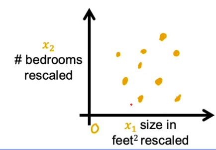
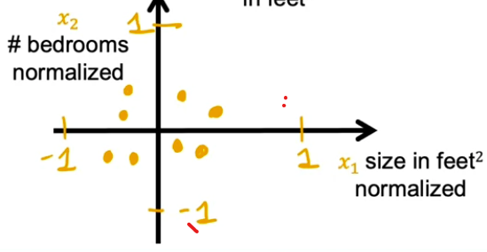

# 📊 Feature Scaling

[← Back to Main Page](../../../README.md) | [← Back to Linear Regression](../README.md)

## 🎯 Method 1: Divide by Maximum Value

### Feature 1
- Range: $300 \leq x_1 \leq 2000$
- Formula: $\hat{x}_1 = \frac{x_1}{2000_{max}}$
- Result: $0.15 \leq \hat{x}_1 \leq 1$

### Feature 2
- Range: $0 \leq x_2 \leq 5$
- Formula: $\hat{x}_2 = \frac{x_2}{5_{max}}$
- Result: $0 \leq \hat{x}_2 \leq 1$

## 📐 Method 2: Mean Normalization

> **Steps:**
> 1. Find mean of each feature
> 2. Subtract mean from each feature value
> 3. Divide each by difference between max and min values

💡 _Results in features with values from -1 to 1_

### Feature 1
- Range: $300 \leq x_1 \leq 2000$
- Formula: $\hat{x}_1 = \frac{x_1 - \mu_1}{2000 - 300}$
- Result: $-0.18 \leq \hat{x}_1 \leq 0.82$

### Feature 2
- Range: $0 \leq x_2 \leq 5$
- Formula: $\hat{x}_2 = \frac{x_2 - \mu_2}{5 - 0}$
- Result: $-0.46 \leq \hat{x}_2 \leq 0.54$

## 📈 Method 3: Z-score Normalization

> **Steps:**
> - Find standard deviation and mean for each feature
> - Subtract mean from each
> - Divide by standard deviation

### Feature 1
- Range: $300 \leq x_1 \leq 2000$
- Formula: $\hat{x}_1 = \frac{x_1 - \mu_1}{\sigma_1}$
- Result: $-0.67 \leq \hat{x}_1 \leq 3.1$

### Feature 2
- Range: $0 \leq x_2 \leq 5$
- Formula: $\hat{x}_2 = \frac{x_2 - \mu_2}{\sigma_2}$
- Result: $-1.6 \leq \hat{x}_2 \leq 1.9$

---
💡 _Feature scaling is crucial for improving the convergence of machine learning algorithms_
