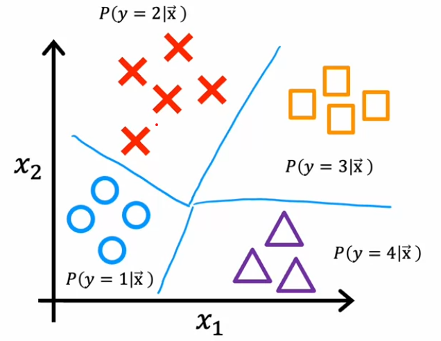

[← Back to Main Page](../../README.md) | [← Back to Overview](../supervised_learning.md)

# 🧠 Neural Networks

## Table of Contents
- [Forward Propagation Implementation](#forward-prop-in-python)
- [TensorFlow Implementation](#building-a-neural-network-tensorflow)
- [Activation Functions](#activation-functions)
- [Multiclass Classification](#multiclass-classification)

---

<div align="center">
  
</div>

## 🔄 [Forward prop in Python](simple_implementation/python_manual.ipynb)
<div align="center">
  
</div>

## 🛠️ [Building a Neural Network Tensorflow](simple_implementation/tensorflow.ipynb)

```python
# Create a Sequential Neural Network
model = Sequential([                      
    Dense(units=3, activation="sigmoid"), # Layer with 3 nodes
    Dense(units=1, activation="sigmoid")  # Output layer
])

#  defines a loss function and specifies a compile optimization
model.compile(
    loss = tf.keras.losses.BinaryCrossentropy(),
    optimizer = tf.keras.optimizers.Adam(learning_rate=0.01),
)

    # BinaryCrossentropy() = Logistic regression (-ylog(f(x)) - (1-y)log(1-f(x)))
    # MeanSquaredError() = Regression 

# runs gradient descent and fits the weights to the data
model.fit(
    Xt,Yt,            
    epochs=10,   # number of steps in gradient decent
)

# list weights and bias
W1, b1 = model.get_layer("layer1").get_weights()
W2, b2 = model.get_layer("layer2").get_weights()
print("W1:\n", W1, "\nb1:", b1)
print("W2:\n", W2, "\nb2:", b2)

# Predict
X_testn = norm_l(X_test)
predictions = model.predict(X_testn)
print("predictions = \n", predictions)
yhat = (predictions >= 0.5).astype(int)
print(f"decisions = \n{yhat}")
```
<br>

## ⚡ Activation Functions

<div align="center">
  
</div>

### 🎯 Choosing a function:
#### Output Layer:
- 🔄 `Binary Classification` → sigmoid
- 📈 `Regression` → Linear activation
- 📊 `Regression` (positive only) → ReLU

#### Hidden Layers
- ⚡ `ReLU` - Recommended for most cases
  - Faster convergence in gradient descent

<details>
<summary>📝 Example Implementation</summary>

```python
model = Sequential([                     
    Dense(units=25, activation="relu"),     # Layer 1
    Dense(units=15, activation="relu"),     # Layer 2
    Dense(units=1, activation="sigmoid")    # Output layer
])
```
</details>

---

## 🎯 Multiclass Classification
> Predicts probability of y being equal to each class

<div align="center">
  
</div>

### 🔢 Softmax Regression Algorithm
<div align="center">
  
</div>

#### 📐 Basic algorithm: 
### $z_j = \vec{w}_j \cdot \vec{x} + b_j \quad j=1, ..., N \\$
### $a_j = \frac{e^{z_j}}{\sum\limits^{N}_{k=1} e^{z_k}} = P(y=j|\vec{x})$

> **Note:** $a_1 + a_2 + ... + a_N = 1$

#### 📊 Softmax Cost function
<div align="center">
  
</div>

<br>

$loss(a_1,...,a_N, y) =  \begin{cases}
   -log \ a_1 \quad \text{if} \ y = 1 \\
   -log \ a_2 \quad \text{if} \ y = 2 \\
    \quad \quad \quad \quad... \\
    -log \ a_N \quad \text{if} \ y = N \\
\end{cases}$

<details>
<summary>📝 Example Implementation</summary>

```python
model = Sequential([                     
    Dense(units=25, activation="relu"),    
    Dense(units=15, activation="relu"),    
    Dense(units=10, activation="softmax")   # units = number of classifications
])

model.compile(
    loss = tf.keras.losses.SparseCategoricalCrossentropy()
    optimizer=tf.keras.optimizers.Adam(0.001),
)

model.fit(X,Y epochs=100)
```
</details>

<details>
<summary>📝 More Accurate Implementation (Recommended)</summary>

```python
# Model
model = Sequential([                     
    Dense(units=25, activation="relu"),    
    Dense(units=15, activation="relu"),    
    Dense(units=10, activation="linear")   # softmax used in loss function instead
])                                         # This is more accurate.

# Loss
model.compile(
     # Uses softmax internally in loss function
    loss = tf.keras.losses.SparseCategoricalCrossentropy(from_logits=True)
    optimizer=tf.keras.optimizers.Adam(0.001),
)

# Fit
model.fit(X,Y epochs=100)

# Predict
prediction = model.predict(X)               
sm = tf.nn.softmax(prediction).numpy()
```
</details>

<br>

## Multi-label Classification


`Identifying more than 1 class from single input`
- ex. From an image identify a pedestrian, a bus, and a car

<br>

### Model options:
1. Neural network for each classification

    

    <br>

2. Train one neural net with multiple outputs

    
