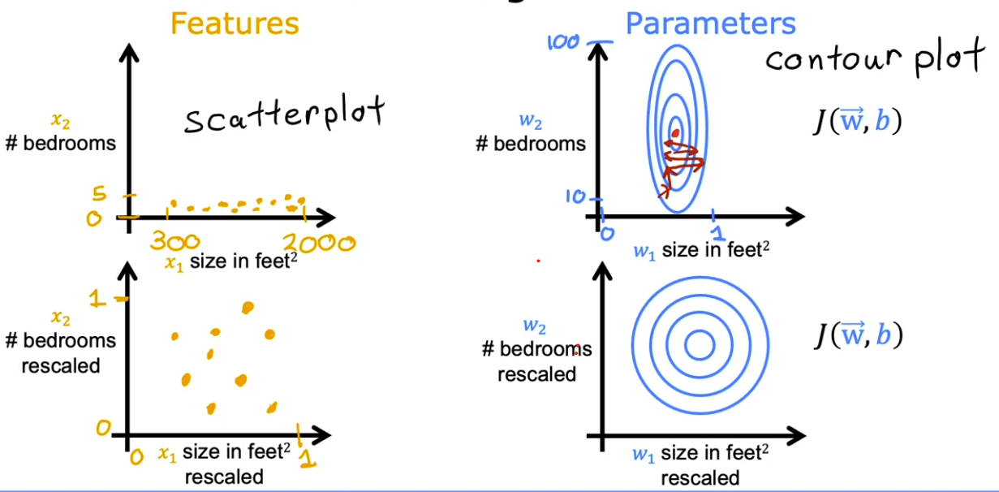
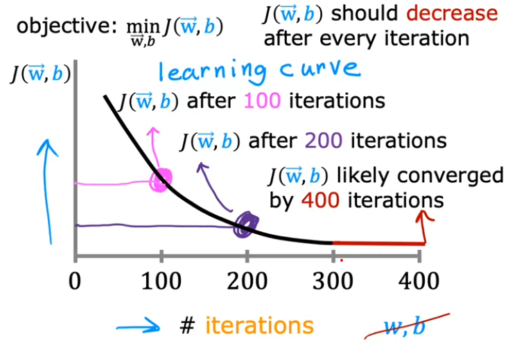
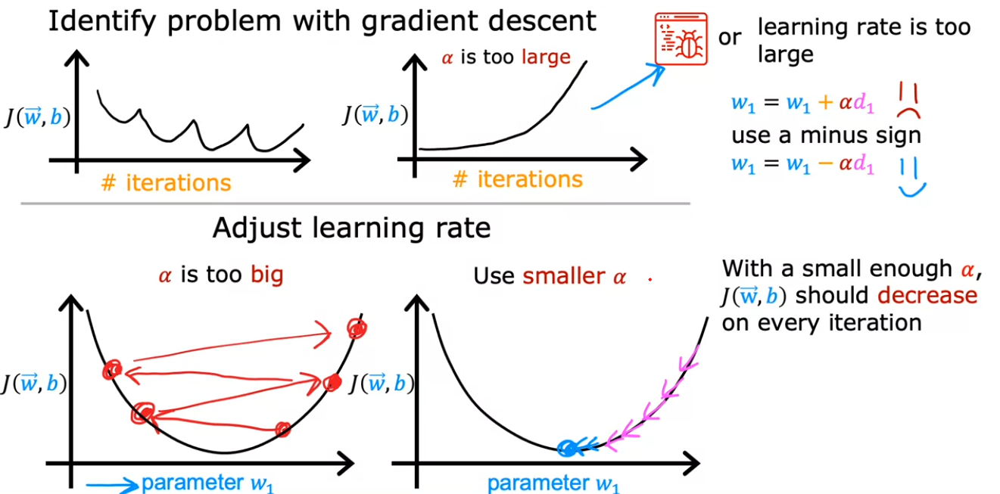
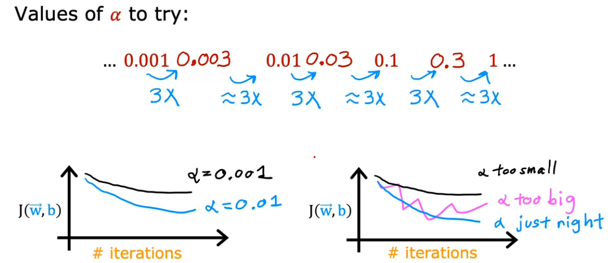
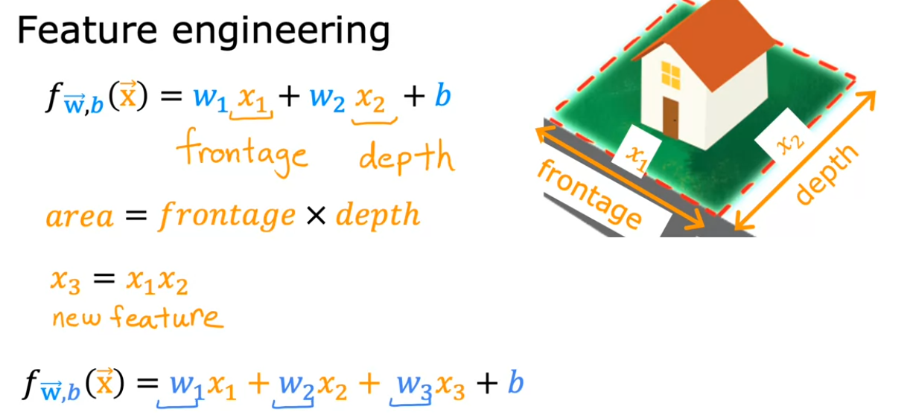

# 📈 Linear Regression

[← Back to Main Page](../../../README.md) | [← Back to Supervised Learning](../../supervised_learning.md)

> Predicting continuous values using linear relationships

## 📋 Contents
- [Single Variable Linear Regression](#single-variable-linear-regression)
- [Multiple Linear Regression](#multiple-linear-regression)
- [Feature Engineering](#feature-engineering)
- [Feature Scaling](#feature-scaling)
- [Checking Gradient Descent Convergence](#checking-gradient-decent-for-convergence)
- [Choosing Learning Rate](#choosing-learning-rate)
- [Implementation with Scikit-learn](scikit-learn/linear_regression_sklearn.ipynb)

## 📝 Key Concepts
- Model trained on labeled input/output pairs
- Fits a straight line through training data
- Uses fitted line to predict future outcomes

## 🔍 Visual Example


## 💡 Applications
- Housing price prediction
- Sales forecasting
- Consumer behavior analysis

## 📘 Implementation Steps
### Single Variable Linear Regression:

#### 1. [Model Representation](single_variate/1_model_representation.ipynb)
#### Representing 𝑓:

f<sub>w,b</sub>(x) = wx + b
- Determines output `ŷ`
- `w` - Slope of line
- `b` - y-intercept

#### 2. [Cost Function](single_variate/2_cost_function.ipynb)
- <b>Squared Error Cost function</b>: Measures accuracy of predictions
```math
J(w,b) = \frac{1}{2m} \sum_{i=1}^{m} (ŷ⁽ⁱ⁾- y⁽ⁱ⁾)²
```
  - `m` = number of training examples
  - `ŷ⁽ⁱ⁾` = predicted value
  - `y⁽ⁱ⁾` = actual value
- Goal: Minimize J(w,b)

#### 3. [Gradient Decent](single_variate/3_gradient_decent.ipynb)
- Have some cost function <b>J(w,b)</b>, want <b>$\min\limits_{w, b}$ J(w,b)</b>
- Takes down path of steepest decent to local minima

<br>

<b>Formula</b>:

tmp_w = w - $\alpha\;\frac{d}{dw}J(w,b)$ <br>
tmp_b = b - $\alpha\;\frac{d}{db}J(w,b)$ <br>
w = tmp_w <br>
b = tmp_b

<br>

#### Derivative of cost function with respect to w and to b: <br> <br>
 ### $\frac{d}{dw}J(w,b)$ = $\frac{1}{m}\sum\limits_{i=1}^{m}(\mathcal{f}_{w,b}(x^{(i)}-y^{(i)})x^{(i)})$ <br> <br>
 ### $\frac{d}{db}J(w,b)$ = $\frac{1}{m}\sum\limits_{i=1}^{m}(\mathcal{f}_{w,b}(x^{(i)}-y^{(i)}))$ <br> <br> 
- `α` = learning rate
  - if too small - greadient descent will be very slow
  - if too large - can overshoot the minimum and fail to converge (diverge)

`Must simultaneously update w and b `

<br>

### Multiple Linear Regression:

- $x_j$ = $j^{th}$ feature
- n = number of features
- $\vec{x}^{(i)}$ = features of $i^{th}$ training example
- $x_{j}^{(i)}$ = value of feature j in $i^{th}$ training example

#### 1. [Model Representation](multiple_linear_regression/multiple_lin_reg.ipynb)
### $\mathcal{f}_{w,b}(x) = w_1x_1 + w_2x_2 + w_3x_3 ... w_jx_j + b = \vec{w} \cdot \vec{x} + b$


Parameters:
- $\vec{w}$ = $[w_1\ w_2\ w_3\ ...w_j]$
- b

In numpy:
```python
f = np.dot(w,x) + b
```

#### 2. [Cost Function](multiple_linear_regression/multiple_lin_reg.ipynb)
### $J(\vec{w},b) = \frac{1}{2m} \sum\limits_{i=1}^{m} (\mathcal{f}_{\vec{w},b}(\vec{x}⁽ⁱ⁾- y⁽ⁱ⁾)²$

#### 3. [Gradient Decent](multiple_linear_regression/multiple_lin_reg.ipynb)
### $w_1 = w_1 - \alpha\frac{1}{m} \sum\limits_{i=1}^{m} (\mathcal{f}_{\vec{w},b}(\vec{x}⁽ⁱ⁾- y⁽ⁱ⁾)x_1^{(i)}$
. . .
### $w_n = w_n - \alpha\frac{1}{m} \sum\limits_{i=1}^{m} (\mathcal{f}_{\vec{w},b}(\vec{x}⁽ⁱ⁾- y⁽ⁱ⁾)x_m^{(i)}$

### $b = b - \alpha\frac{1}{m} \sum\limits_{i=1}^{m} (\mathcal{f}_{\vec{w},b}(\vec{x}⁽ⁱ⁾- y⁽ⁱ⁾)$

`w = np.array([0.5, 1.3, ... 3.4])` <br>
`d = np.array([0.3, 0.2, ... 0.4])` - derivatives <br>
compute $w_j = w_j - 0.1d_j$ for j=1....n

```python
# Vectorized in numpy
w = w - 0.1 * d
```
<br>

** `NORMAL EQUATION` **
- Alternative to gradient decent
- Only for linear regression
- Some libraries may use on backend
- Slow > 10k features


<br>

## [Feature Scaling](feature_scaling/README.md)



- If feature differ greatly (i.e. Feature 1 in 1s, Feature 2 in 1000s)
  - Plot axis will be skewed
  - Cause contour plot of cost function to be narrow
  - Slows gradient decent
- Scale features to be similiar values
  - Creates more circular contour plot
  - More direct path for gradient decent


<br>

## [Checking gradient decent for convergence](feature_scaling/Feature_Scaling_and_Learning_Rate.ipynb)


#### If working properly:
- Gradient decent should decrease after each iteration

#### If J increases:
- Alpha chosen poorly
- Bug in code

#### # Iterations needed to converge varies

### Checking Convergence:
- Create learning curve graph and view
- Automatic convergence test: <br>
$ let \ \epsilon = 10^{-3} \ or \ 0.001 $ <br>
If $J(\vec{w},b)$ decreases by $\leq \epsilon$ in 1 iteration declare convergence

<br>

## [Choosing learning rate](feature_scaling/Feature_Scaling_and_Learning_Rate.ipynb)

- Set learning rate to very smal number:
  - if cost does not go down on each iter (for debugging), most likely bug in code 

<br>



### To find optimal rate:
1. Start with small learning rate
2. Increase by 3x each time
3. Identify values too small and too large
4. Pick slightly smaller than largest that converges

<br>

## [Feature Engineering]()



### Methodology:
- Use intuition to design new features
- Transform or combine original features

### Example:
1. Find that area of property may contribute to cost of house more than frontage or depth
2. Create new feature by multiplying frontage x depth


<br>

---

_Learning the relationships between variables to make predictions_