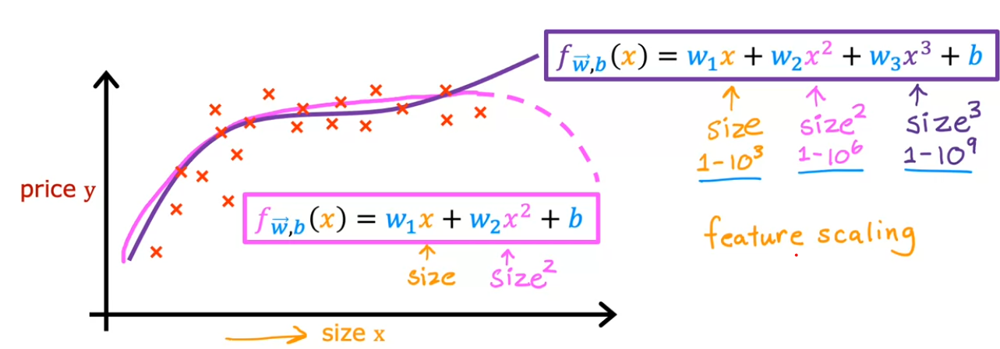

# 📈 Polynomial Regression

[← Back to Main Page](../../../README.md) | [← Back to Supervised Learning](../../supervised_learning.md)

> Extending linear regression to fit non-linear relationships

## 🔍 Visual Example

## 📝 Key Concepts
- Add new features by:
  - Raising features to higher powers
  - Taking square root of features
  - Combining features
- Feature scaling becomes increasingly important as power increases

## 💡 Feature Creation Examples
- $x_1^2$ (square)
- $x_1^3$ (cube)
- $\sqrt{x_1}$ (square root)
- $x_1 \cdot x_2$ (multiplication)

## [Implemenation]()

 
---
💡 _Polynomial regression allows modeling of complex non-linear relationships_