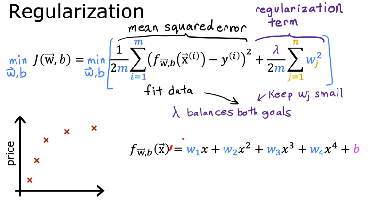

# Regularization

### Intuition
- Regularization term penalized model for large values of $w_j$
- $\lambda$ = 0  will overfit
- $\lambda$ = $10^{10}$ will underfit

 

## Implementation

### $w_j = w_j - \alpha [\frac{1}{m} \sum\limits^{m}_{i=1}[(\mathcal{f}_{\vec{w},b}(\vec{x}^{(i)}) -y^{(i)}) \ x^{(i)}_{j}] + \frac{\lambda}{m} w_j] $

### $b = b - \alpha \frac{1}{m} \sum\limits^{m}_{i=1}(\mathcal{f}_{\vec{w},b}(\vec{x}^{(i)}) -y^{(i)}) $

 

####  Linear Regression: $ \quad \ \ \ \mathcal{f}_{\vec{w},b}(\vec{X}) = \vec{w} \cdot \vec{x} + b$ 

####  Logistic Regression: $ \quad \mathcal{f}_{\vec{w},b}(\vec{X}) = \frac{1}{1 + e^{-(\vec{w} \cdot \vec{x} + b)}}$

 

S