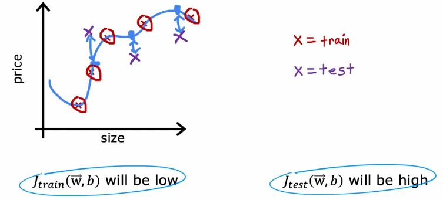
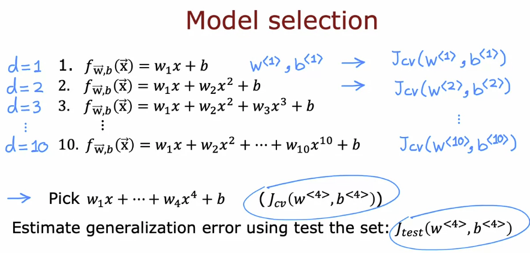
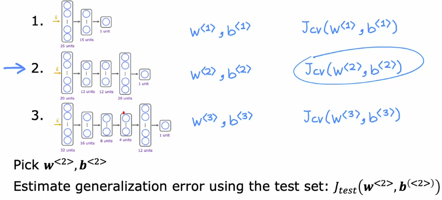
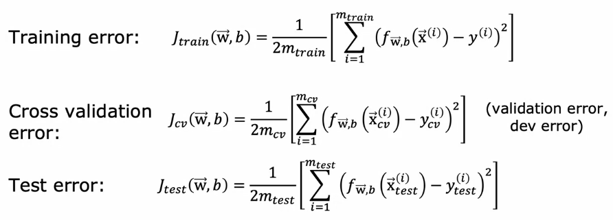
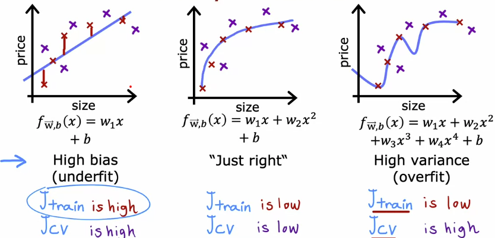
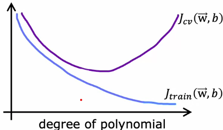
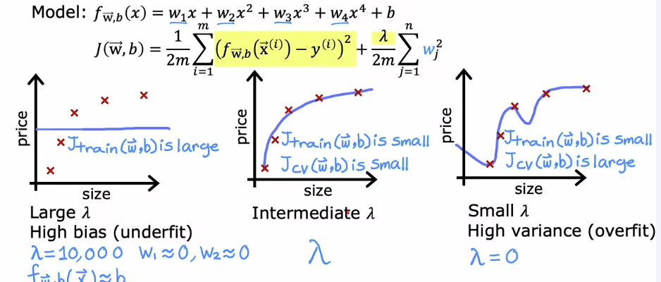
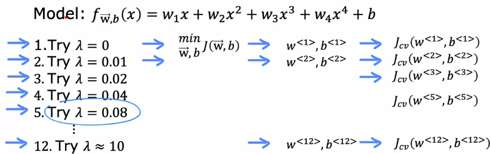
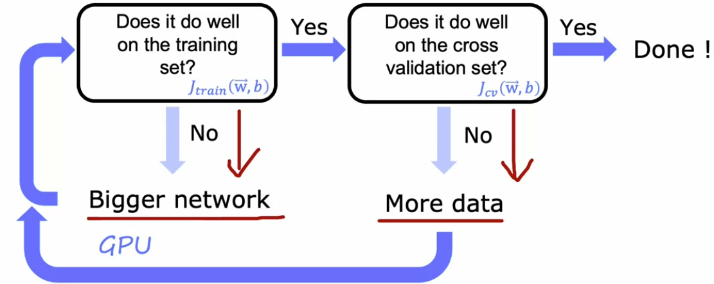
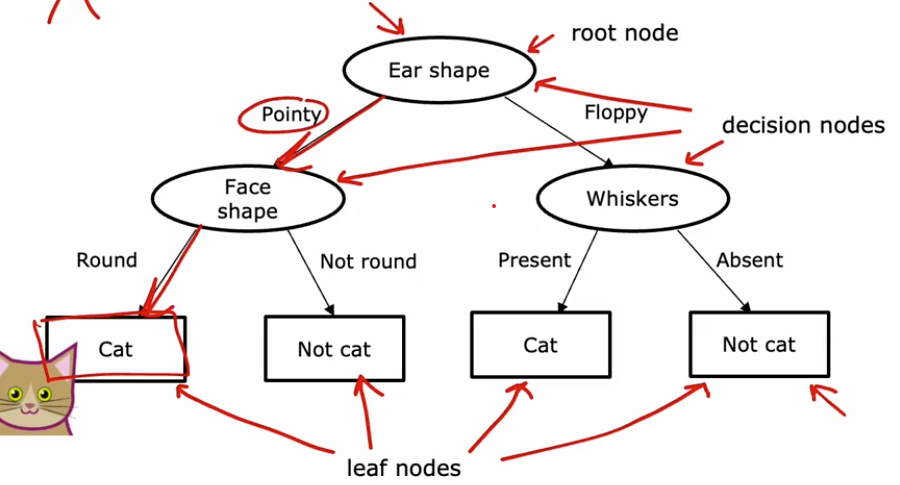

# 🎯 Supervised Learning

[← Back to Main Page](../README.md) | [← Back to Overview](../machine_learning.md)

## Table of Contents
- [Key Concepts](#-key-concepts)
- [Common Applications](#-common-applications)
- [Types of Supervised Learning](#-types-of-supervised-learning)
  - [Regression](#1-regression-)
  - [Classification](#2-classification-️)
- [Overfitting](#overfitting)
  - [Addressing Overfitting](#addressing-overfitting)
  - [Regularization](#regularization)
- [Neural Networks](#neural-networks)
- [Evaluating a model](#evaluating-a-model)
- [Model Selection](#model-selection)
- [Bias & Variance](#bias--variance)
  - [Regularization](#regularization-1)
  - [Debugging a learning algorithm](#debugging-a-learning-algorithm)
  - [Neural Networks](#neural-networks-1)

> Learning from labeled examples to make predictions

## 📝 Key Concepts

- Training uses labeled data with "right answers"
- Input features (x) map to output labels (y)
- Model learns to predict output (ŷ) for new inputs

## 🔍 Common Applications

---
## 📊 Types of Supervised Learning

### 1. Regression 📈
> Predicts continuous numerical values from infinite possibilities

#### Types
- [Linear Regression](regression/linear_regression/README.md)
  - Simple linear relationships
  - Continuous output values

- [Polynomial Regression](regression/polynomial_regression/README.md)
  - Use more complex function to better fit data

#### Use Cases:
- Housing price prediction
- Temperature forecasting
- Stock price estimation

### 2. Classification 🏷️
> Predicts discrete categories or classes

#### Types
- [Logistic Regression](classification/logistic_regression/README.md)

#### Use Cases:
- Email spam detection
- Image recognition
- Medical diagnosis

---

## Overfitting

<table>
  <tr>
    
       
  </tr>
</table>

#### Terms:
- `high bias` - underfits the training data 
- `high variance` - overfits the training data
- `generalization` - does well on examples not in the training set

### Addressing Overfitting
1. Collect more training examples
2. Select fewer features
    - reduce total or polynomial features 
3. Regularization
  - reduces impact of features

 

### [Regularization](regularization/README.md) :
   

 

## [Neural Networks](neural_networks/README.md)

 

## Evaluating a model
1. Split dataset into 2 portions:
    - 70% training set
    - 30% Test set 
  
2. Train model with training set

3. Evaluate model by computing training error and test error
    - Do not use regularization term for these calculations

### Regression Overfitting example:

 

### Classification

$J_{test}(\vec{w},b)$ = fraction of test set that were misclassified  
$J_{train}(\vec{w},b)$ = fraction of training set that were misclassified

 

## [Model Selection](model_selection/model_selection.ipynb):
### 1. Split data

- 60% - Training set
- 20% - Cross Validation or Dev set 
- 20% - Test set

`Cross validation will check validity of different models`

 

### 2. Try different models

- #### Different degree polynomials
  

- #### Different neural network architecture
  
 

### 3. Calculate error

### 4. Pick model with lowest Dev error

### 5. Use test set to estimate generalization error

 

## [Bias & Variance](bias_variance/diagnosing_bias_and_variance.ipynb)

 

#### Comparing error to degree of polynomial 

 

### Regularization

#### Effects on bias and variance:

S
 

#### Choosing regularization parameter $\lambda$ :

- Check with cross-validation set

### Debugging a learning algorithm

#### High Bias:
- Try adding polynomial features ($x^{2}_1, x^{2}_2, x_1,x_2$, etc)
- Try getting additional features
- Try decreasing $\lambda$

#### High Variance
- Get more training data
- Try smaller set of features
- Try increasing $\lambda$

 

### Neural Networks
- Large neural networks are low bias machines
- Larger neural network will do better than s

  #### To get accurate model: 

  

   
  

## [Decision Trees](decision_trees/README.md)

#### Decision 1: How to choose which feature to split on each node
- Maximize purity (minimize impurity)

#### Decision  2: When do you stop splitting?
- when a node is 100% one class
- When splitting a node will result in the tree exceeding a maximum depth 
- When improvements in purity score are below a threshold
- When number of examples in a node is below a threshold

### When to use:
#### Decision Trees and Tree ensembles
- Works well on tabular (structured) data
- Not recommended for unstructured data (images, audio, text)
- Fast
- Small trees may be human interpretable

#### Neural Networks:
- Works well on all types of data ( tabular (structured) and unstructured)
- Slower than decision tree
- Works with transfer learning
- Easier to string together multiple neural networks