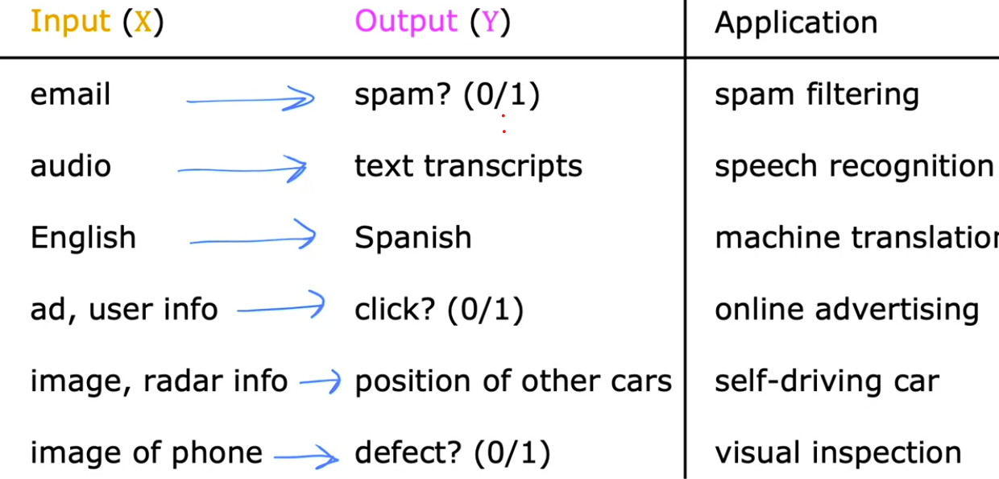
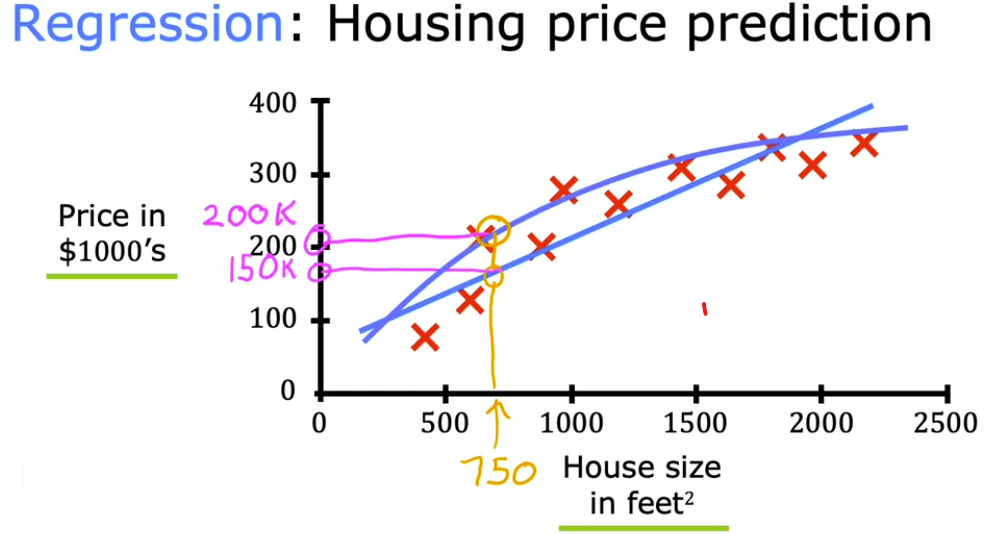
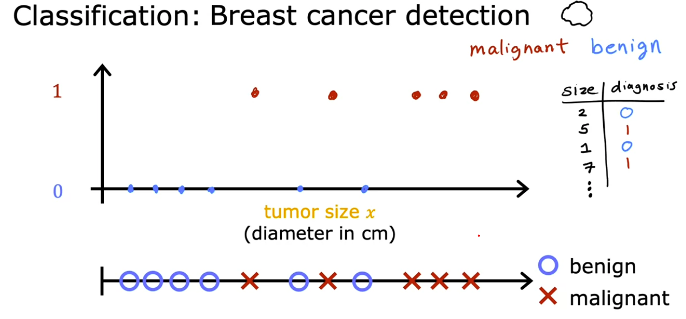
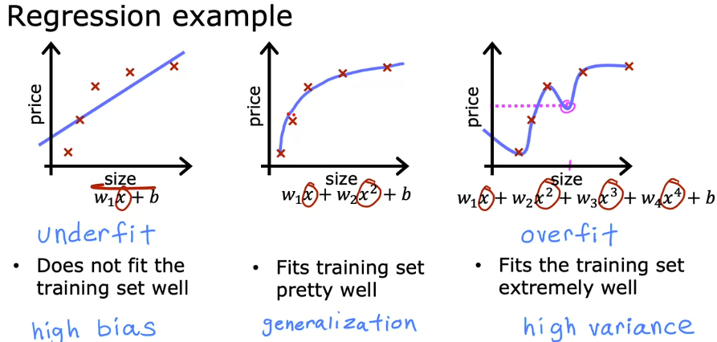
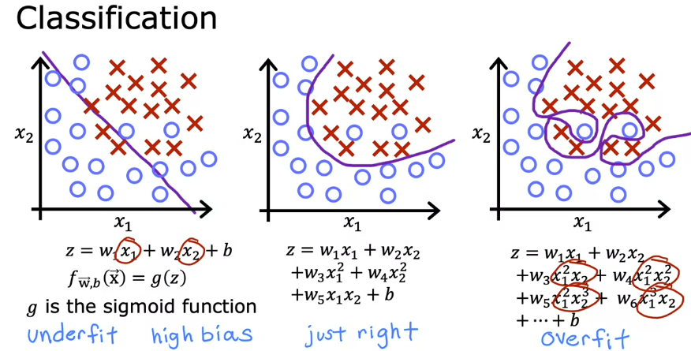
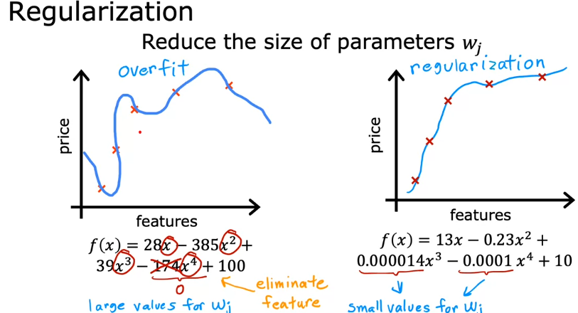

# 🎯 Supervised Learning

[← Back to Main Page](../README.md) | [← Back to Overview](../machine_learning.md)

> Learning from labeled examples to make predictions

## 📝 Key Concepts

- Training uses labeled data with "right answers"
- Input features (x) map to output labels (y)
- Model learns to predict output (ŷ) for new inputs

## 🔍 Common Applications

---
## 📊 Types of Supervised Learning

### 1. Regression 📈
> Predicts continuous numerical values from infinite possibilities

#### Types
- [Linear Regression](regression/linear_regression/README.md)
  - Simple linear relationships
  - Continuous output values

- [Polynomial Regression](regression/polynomial_regression/README.md)
  - Use more complex function to better fit data

#### Use Cases:
- Housing price prediction
- Temperature forecasting
- Stock price estimation

### 2. Classification 🏷️
> Predicts discrete categories or classes

#### Types
- [Logistic Regression](classification/logistic_regression/README.md)

#### Use Cases:
- Email spam detection
- Image recognition
- Medical diagnosis

---

## Overfitting

<table>
  <tr>
    
       
  </tr>
</table>

#### Terms:
- `high bias` - underfits the training data 
- `high variance` - overfits the training data
- `generalization` - does well on examples not in the training set

### Addressing Overfitting
1. Collect more training examples
2. Select fewer features
    - reduce total or polynomial features 
3. Regularization
  - reduces impact of features

 

### Regularization :
   