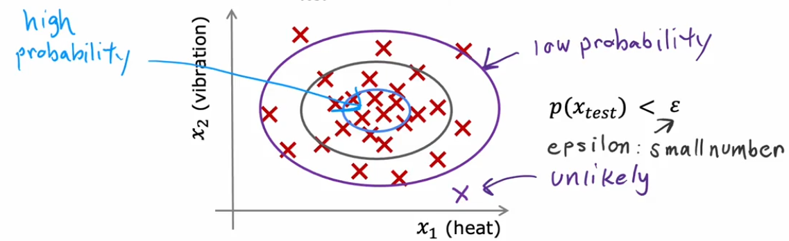
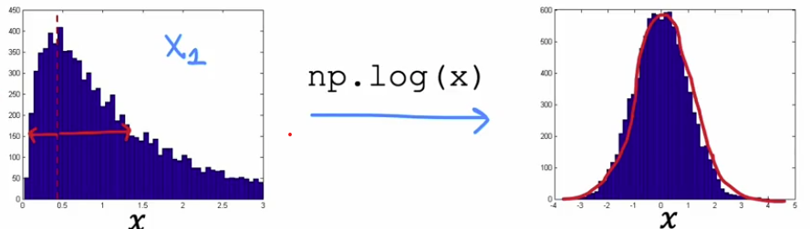

# Anomaly Detection
[← Back to Main Page](../../README.md) | [← Back to Unsupervised Learning](../unsupervised_learning.md)

## Table of Contents
- [Density Estimation](#density-estimation)
  - [Formula](#formula)
  - [Algorithm](#algorithm)
  - [Training and Evaluation](#training-and-evaluating)
- [Feature Selection](#choosing-features)
  - [Gaussian Transformation](#transform-non-gaussian-feature-into-gaussian-features)

---

## Density Estimation

  

### Formula

Given:
- Training set: $\{\vec{x}^{(1)}, \vec{x}^{(2)}, ..., \vec{x}^{(m)}\}$
- Each example $\vec{x}^{(i)}$ has $n$ features

The probability density function:

$$p(\vec{x}) = p(x_1;\mu_1, \sigma^{2}_1) \ * \ p(x_2;\mu_2, \sigma^{2}_2) \ * ... *\ p(x_n;\mu_n, \sigma^{2}_n)$$

$$= \prod\limits^{n}_{j=1}p(x_j; \mu_j, \sigma^{2}_j)$$

### Algorithm

1. Choose $n$ features $x_i$ that may be indicative of anomalous examples
2. Fit parameters $\mu_1, \sigma_1^2, ..., \mu_n, \sigma_n^2$:

   $$\mu_j = \frac{1}{m} \sum\limits^{m}_{i=1}\vec{x}^{(i)} \quad \quad \sigma^2_j = \frac{1}{m}\sum\limits^{m}_{i=1}(x^{(i)}_j - \mu_j)^2$$

3. Given new example $x$, compute $p(x)$:

   $$\prod\limits^{n}_{j=1}\frac{1}{\sqrt{2\pi\sigma_j}}e^{-\frac{(x_j-\mu_j)^2}{2\sigma^{2}_j}}$$

### Training and Evaluating

- Training set: all non-anomalous
- CV & Test sets: small number of anomalous for evaluation

---

## Choosing Features

> Harder for algorithm to figure out which features to ignore.
> Choosing correct features is more important than supervised learning.

### Transform Non-gaussian Feature into Gaussian Features

  

**Transformation Methods:**
- $x_1 \gets log(x_1)$
- $x_2 \gets log(x_2 + c)$
- $x_3 \gets \sqrt{x_3}$
- $x_4 \gets \sqrt[3]{x_3}$

