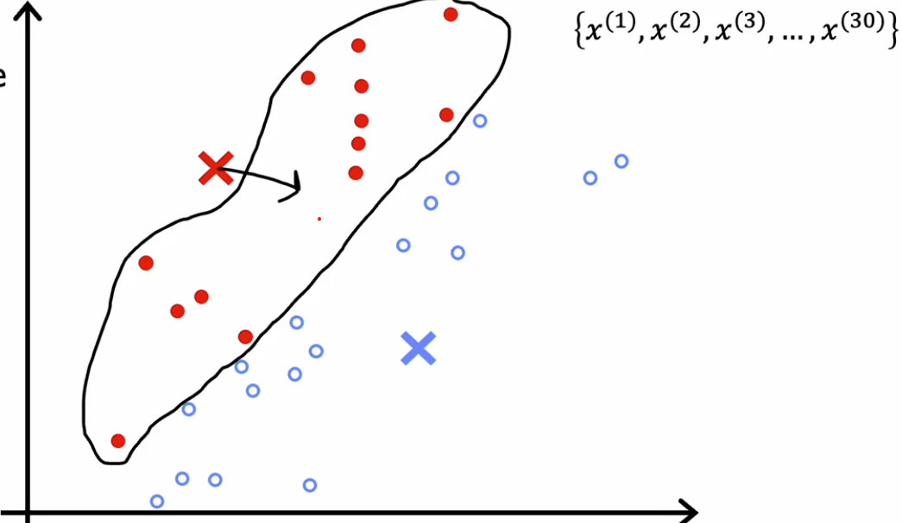
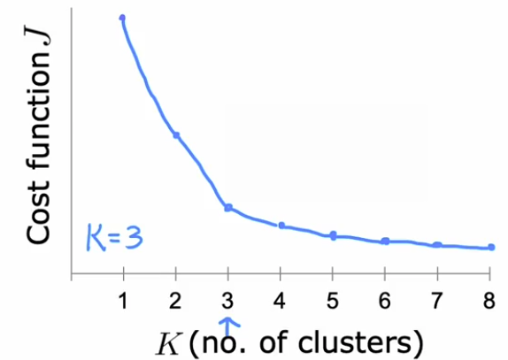
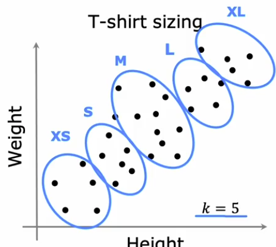

# Clustering

[← Back to Main Page](../../README.md) | [← Back to Unsupervised Learning](../unsupervised_learning.md)

## [K-means](kmeans/kmeans.ipynb)
1. Picks centroid (cluster center)
2. Assign each point closest centroid
3. Recompute centroid (by taking average(mean) of all assigned points)
4. Repeat until no more changes

    

 

### K-mean Algorithm

#### Terms:

- $c^{(i)} =$ index of cluster(1,2,..,K) to which $x^{(i)}$ is currently assigned
- $u_k =$ cluster cetnroid $k$ 
- $u_{c^{(i)}}$ = cluster cetnroid of cluster to which example $x^{(i)}$ has been assigned

 

#### Steps:
1. Randomly initialize K cluster centroids
    
    $u_1, u_2, ... , u_k $

2. Assign points to cluster centroids

    for $ i = 1 \text{ to } K$

    $ c^(i) := $ index (from 1 to K) of cluster centroid closest to $x^(i)$

3. Move cluster centroids

    for $k = 1 \text{ to } K$

    $u_k := $ acerage (mean) of points assigned to cluster k 

4. Repeat

 

### Cost Function (distortion):

### $J(c^{(1)}, ..., c^{(m)}, \mu_1, ..., \mu_K) = \frac{1}{m} \sum\limits^{m}_{i=1}||x^{(i)} - \mu_{c^{(i)}}||^2$

- Minimizes by assigning to closest cluster centroid
- Then by selecting the average (mean) of all examples assigned to cluster centroid

 

### Initializing K-means
- Choose K < m

#### Random initialization

1. Randomly pick K training examples
2. Set $\mu_1, ...,\mu_k$ equal to these K examples 
3.  Run 50-1000 times
4.  Compute cost function for each try
5.  Pick one with lowest cost

 

### Choosing number of clusters

#### Elbow method

 

`Often K is decided by some downstream purpose`

 

