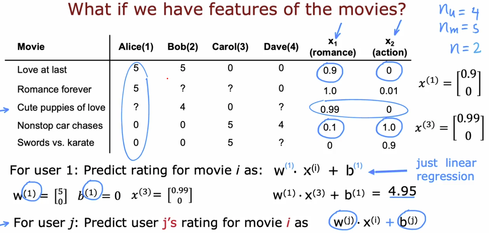

# Recommender Systems

## Per Item Features:

### Notation:
- $r(i,j)$ = 1 if user j has rate moveie i (0 otherwise)
- $y^{(i,j)}$ = rating fiven by user j on movie i (if defined)
- $w^{(j)}, b^{(j)}$ = parameters for user j
- $x^{(i)}$ = feature vector for movie i
- $m^{(j)}$ = # of movies rated by user j
- $n$ = # of features

 

### Cost function

#### For user J:

### $$ \min\limits_{w^{(j)}b^{(j)}} J(w^{(j)}, b^{(j)}) = \frac{1}{2m^{(j)}} \sum\limits_{i:r(i,j)=1} (w^{(j)} \cdot x^{(i)} + b^{(j)} - y^{(i,j)} )^2 + \frac{\lambda}{2m^{(j)}} \sum\limits^{n}_{k=1}(w_k^{(j)})^2 $$

#### For all users:

### $$ \frac{1}{2} \sum\limits^{n_u}_{j=1} \sum\limits_{i:r(i,j)=1} (w^{(j)} \cdot x^{(i)} + b^{(j)} - y^{(i,j)} )^2 + \frac{\lambda}{2} \sum\limits^{n_u}_{j=1} \sum\limits^{n}_{k=1}(w_k^{(j)})^2 $$

 

### To learn features if none are available:

#### To learn $x^{(i)}$: 

### $$J(x^{(i)}) = \frac{1}{2} \sum\limits_{i:r(i,j)=1} (w^{(j)} \cdot x^{(i)} + b^{(j)} - y^{(i,j)} )^2 + \frac{\lambda}{2} \sum\limits^{n}_{k=1}(x_k^{(i)})^2 $$

#### To learn $x^{(1)}, x^{(2)}, ..., x^{(,)} $:

### $$J(x^{(i)}) = \frac{1}{2} \sum\limits^{n_m}_{i=1} \sum\limits_{i:r(i,j)=1} (w^{(j)} \cdot x^{(i)} + b^{(j)} - y^{(i,j)} )^2 + \frac{\lambda}{2} \sum\limits^{n_m}_{i=1} \sum\limits^{n}_{k=1}(x_k^{(i)})^2 $$

 

### `Overall Cost function:`

### $$ J(w, b, x) = \frac{1}{2} \sum\limits_{(i,j):r(i,j)=1} (w^{(j)} \cdot x^{(i)} + b^{(j)} - y^{(i,j)} )^2 + \frac{\lambda}{2} \sum\limits^{n_u}_{j=1} \sum\limits^{n}_{k=1}(w_k^{(j)})^2 + \frac{\lambda}{2} \sum\limits^{n_m}_{i=1} \sum\limits^{n}_{k=1}(x_k^{(i)})^2 $$

 

## Gradient Decent

$$ w_i^{(j)} = w_i^{(j)} - \alpha \frac{\mathcal{d}}{dw_i^{(j)}} J(w,b,x)$$
$$ b^{(j)} = b^{(j)} - \alpha \frac{\mathcal{d}}{db^{(j)}} J(w,b,x)$$
$$ x_k^{(i)} = x_k^{(i)} - \alpha \frac{\mathcal{d}}{dx_k^{(i)}} J(w,b,x)$$