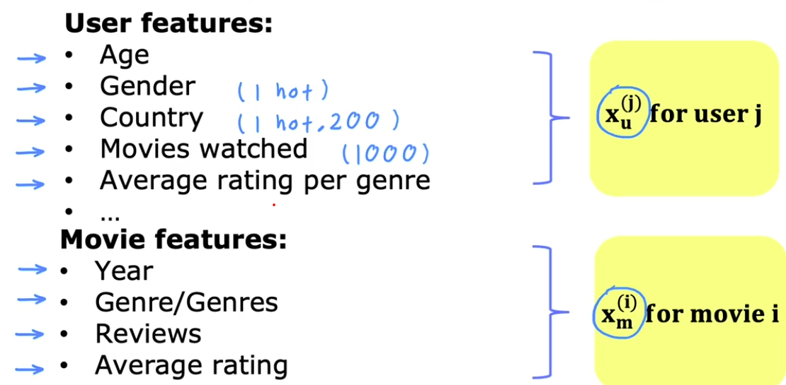

# Recommender Systems

## [Collaborative filtering](collaborative_filtering/collaborative_filtering.ipynb)

### Per Item Features:

#### Notation:
- $r(i,j)$ = 1 if user j has rate moveie i (0 otherwise)
- $y^{(i,j)}$ = rating fiven by user j on movie i (if defined)
- $w^{(j)}, b^{(j)}$ = parameters for user j
- $x^{(i)}$ = feature vector for movie i
- $m^{(j)}$ = # of movies rated by user j
- $n$ = # of features

 

### Cost function

#### For user J:

### $$ \min\limits_{w^{(j)}b^{(j)}} J(w^{(j)}, b^{(j)}) = \frac{1}{2m^{(j)}} \sum\limits_{i:r(i,j)=1} (w^{(j)} \cdot x^{(i)} + b^{(j)} - y^{(i,j)} )^2 + \frac{\lambda}{2m^{(j)}} \sum\limits^{n}_{k=1}(w_k^{(j)})^2 $$

#### For all users:

### $$ \frac{1}{2} \sum\limits^{n_u}_{j=1} \sum\limits_{i:r(i,j)=1} (w^{(j)} \cdot x^{(i)} + b^{(j)} - y^{(i,j)} )^2 + \frac{\lambda}{2} \sum\limits^{n_u}_{j=1} \sum\limits^{n}_{k=1}(w_k^{(j)})^2 $$

 

### To learn features if none are available:

#### To learn $x^{(i)}$: 

### $$J(x^{(i)}) = \frac{1}{2} \sum\limits_{i:r(i,j)=1} (w^{(j)} \cdot x^{(i)} + b^{(j)} - y^{(i,j)} )^2 + \frac{\lambda}{2} \sum\limits^{n}_{k=1}(x_k^{(i)})^2 $$

#### To learn $x^{(1)}, x^{(2)}, ..., x^{(,)} $:

### $$J(x^{(i)}) = \frac{1}{2} \sum\limits^{n_m}_{i=1} \sum\limits_{i:r(i,j)=1} (w^{(j)} \cdot x^{(i)} + b^{(j)} - y^{(i,j)} )^2 + \frac{\lambda}{2} \sum\limits^{n_m}_{i=1} \sum\limits^{n}_{k=1}(x_k^{(i)})^2 $$

 

#### `Overall Cost function:`

### $$ J(w, b, x) = \frac{1}{2} \sum\limits_{(i,j):r(i,j)=1} (w^{(j)} \cdot x^{(i)} + b^{(j)} - y^{(i,j)} )^2 + \frac{\lambda}{2} \sum\limits^{n_u}_{j=1} \sum\limits^{n}_{k=1}(w_k^{(j)})^2 + \frac{\lambda}{2} \sum\limits^{n_m}_{i=1} \sum\limits^{n}_{k=1}(x_k^{(i)})^2 $$

 

### Gradient Decent

$$ w_i^{(j)} = w_i^{(j)} - \alpha \frac{\mathcal{d}}{dw_i^{(j)}} J(w,b,x)$$
$$ b^{(j)} = b^{(j)} - \alpha \frac{\mathcal{d}}{db^{(j)}} J(w,b,x)$$
$$ x_k^{(i)} = x_k^{(i)} - \alpha \frac{\mathcal{d}}{dx_k^{(i)}} J(w,b,x)$$

 

### Binary Label:

 

#### Predict probability of $y^{(i,j) = 1}$ given by $g(w^{(j)} \cdot x^{(i)} + b^{(j)})$:

#### where: $\quad g(z) = \frac{1}{1+e^{-z}}$

  

#### Cost Function:

#### Singles Example:

### $$L(f_{\mathbf(w,b,x)} \mathbf(x), y^{(i,j)}) = -y^{(i,j)} \log(f_{(w,b,x)}(x)) - (1 - y^{(i,j)}) \log(1 - f_{(w,b,x)}(x))$$

 

#### For all examples:

### $$ J(w,b,x) = \sum\limits_{(i,j):r(i,j)=1} L(f_{\mathbf(w,b,x)} \mathbf(x), y^{(i,j)})$$

 

### Mean Normalization

Steps:
1. Compute average rating for each examples
2. Subtract mean from each measurement
3. Add mean back when making predictions

    

    

     
    

### Finding Related Items

#### Find item k with $x^{(k)}$ simillar to $x^{(i)}$ (smallest distance):

### $$\sum \limits^n_{l=1}(x^{(k)}_l - x^{(i)}_l)^2$$

### $$= ||x^{(k)} - x^{(i)}||^2$$

 

## Content-based Filtering

 

`Recommend items based on features of user and item to find match`

#### Notation:
- $r(i,j)$ = 1 if user j has rate moveie i (0 otherwise)
- $y^{(i,j)}$ = rating fiven by user j on movie i (if defined)

### Predict rating of user $j$ on movie $i$:

### $$\underbrace{\vec{V}^{(j)}_u}_{\text{computed from }x^{(j)}_u} \cdot \underbrace{\vec{V}^{(i)}_m}_{\text{computed from }x^{(i)}_m}$$

 

### Neural network architecture
`Networks must have same number output layer`

 

 

- $\vec{V}^{(j)}_u \cdot \vec{V}^{(i)}_m$ - For number prediction
- $g(\vec{V}^{(j)}_u \cdot \vec{V}^{(i)}_m)$ - For classification

