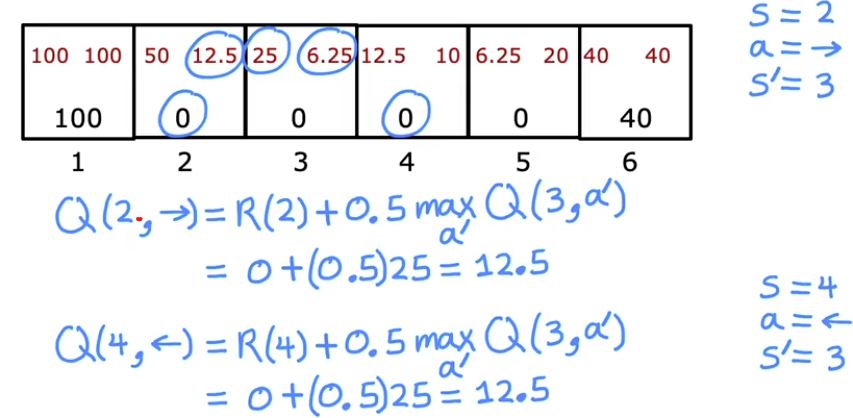
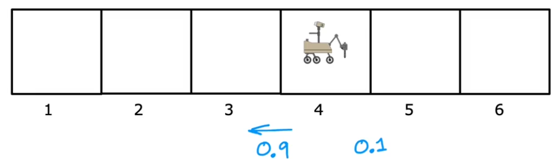

# [Reinforcement Learning](lunar_lander/lunar_lander.ipynb)
[← Back to Main Page](../../README.md) | [← Back to Unsupervised Learning](../unsupervised_learning.md)

## Table of Contents
- [Basics (Markov Decision Process)](#basics-markov-decision-process)
- [The Return](#the-return)
- [Policy](#policy)
- [State Action Value Function (Q-function)](#state-action-value-function-q-function)
- [Bellman Equation](#bellman-equation)
- [Stochastic Environment](#stochastic-environment)
- [Continuous State](#continuous-state)
- [Lunar Lander](#lunar-lander)
  - [Learning Algorithm](#learning-algorithm)
  - [Deep Reinforcement Learning](#deep-reinforcement-learning)
  - [Epsilon Greedy Policy](#epsilon-greedy-policy)
  - [Mini-batch Gradient Decent](#mini-batch-gradient-decent)
  - [Soft Update](#soft-update)

 

## Basics (Markov Decision Process)
$\text{state }s \longrightarrow \text{action }a  $

$ \text{position of helicopter } \longrightarrow \text{how to move control sticks } $

$\text{reward function}: \\$
$\bullet \text{ positive reward: flying well } +1 \\$
$\bullet \text{ negative reward: crash } - 1000$

 

## The Return

### Return $ = R_1 + \gamma R_2 + \gamma^2 R_3 + ...$ terminal state 
#### Discount Factor $\gamma = 0.9$ (commonly a number close to 1)

 

## Policy

>### Goal:  Find policy $\pi$ that tells action $(a = \pi(s))$ to take in ever state (s) to maximize the return 

 

## State action value function (Q-function)

>Gives the return

$Q^{*}$ = Optimal $Q$ function

$Q(s,a) = $ Return if you:

- Start in state $s$
- Take action $a$ once
- Behave optimally after that

 

>#### Best possible return from state $s$ is $\max\limits_{a}Q(s,a)$ 

>#### Best possible action from state $s$ is the action $a$ that gives $\max\limits_{a}Q(s,a)$ 

 

## Bellman Equation

#### Notation:
- $s$ : current state
- $a$ : current action
- $R(s)$ : reward of urrent state
- $s\prime$ : state you get to after action $a$
- $a\prime$ : action you take in state $s\prime$

### $$Q(s,a) = \underbrace{R(s)}_{\text{immediate reward}} + \underbrace{\gamma \max\limits_{a\prime}Q(s\prime, a\prime)}_{\text{return from behaving optimally from state } s\prime} $$ 

### $$Q(s,a) = R(s) \text{ - if in terminal state}$$

 

## Stochastic Environment

- 90% chance robot takes correct path
- 10% chance robot takes wrong path 

 

## Continuous State
- `Discrete State` : One of a infinte set of positions
- `Continuous State` : Infinite state space

 

$$
\ S \text{ (State) }=
\begin{array}{rl}
\left[\begin{array}{c}
x\\[4mm]
y\\[4mm]
\theta\\[4mm]
\dot{x}\\[4mm]
\dot{y}\\[4mm]
\dot{\theta}
\end{array}\right]
&
\begin{array}{l}
\quad\ x \text{ position }\\[4mm]
\quad\ y \text{ position }\\[4mm]
\quad\ \theta \text{ orientation }\\[4mm]
\quad\ \dot{x} \text{ velocity in x direction }\\[4mm]
\quad\ \dot{y} \text{ velocity in y direction }\\[4mm]
\quad\ \dot{\theta} \text{ velocity of orientation change }
\end{array}
\end{array}
$$

 

## Lunar Lander 
 

    

 

$$
\ S \text{ (State) }=
\begin{array}{rl}
\left[\begin{array}{c}
x\\[4mm]
\dot{x}\\[4mm]
y\\[4mm]
\dot{y}\\[4mm]
\theta\\[4mm]
\dot{\theta}\\[4mm]
l\\[4mm]
r
\end{array}\right]

&
\begin{array}{l}
\quad\ x \text{ position }\\[4mm]
\quad\ \text{ velocity in x direction }\\[4mm]
\quad\ y \text{ position }\\[4mm]
\quad\text{ velocity in y direction }\\[4mm]
\quad\ \text{ velocity in y direction }\\[4mm]
\quad\ \text{ velocity of orientation change }\\[4mm]
\quad\ \text{ left foot on ground }\\[4mm]
\quad\  \text{ right foot on ground }
\end{array}
\end{array}
$$

#### Actions:
- do nothing
- left thruster
- main thruster
- rigth thruster

 

### Reward Function:
- Getting to landing pad: +100-140 (depending on being centered)
- Reward for moving toward/away pad
- Crash: -100
- Soft landing: +100
- Leg grounded: +10
- Fire main engine: -0.3 -> penalize gas consumption 
- Fire side thruster: -0.03 -> ^
 

### Bellman Equation:

### Learning Algorithm:
1. Initialize neural network randomly as guess of $Q(s,a)$
2. Repeat {  
    - Take actions in the lunar land. Get $(s,a,R(s),s\prime)$  
    - Store 10,00 most recent $(s,a,R(s),s\prime)$ tuple (Replay Bufffer)  }
3. Train neural network:  
   - Create training set of 10,00 example using  
    $x = (s,a)$ and $y=R(s) + \lambda \max \limits_{a\prime}Q(s\prime, a\prime)$
    - Train $Q_{new}$ such that $Q_{new}(s,a) \approx y$
4. Set $Q = Q_{new}$

 

### Deep Reinforcement Learning:

 

### Epsilon Greedy Policy:
#### $\epsilon$ - greedy policy ($\epsilon = 0.05$)
- With probability 0.95, pick action $a$ that maximizes $Q(s,a)$ (Greedy action).
- With probability 0.05, pick an action $a$ randomly (exploration)
    - Learn about 

 

> Common practice to start $\epsilon$ high and gradually decrease
- For better training on actions

### Mini-batchGradient Decent:

<table>
    <tr>
        <td></td>
        <td></td>
    </tr>
</table>
 

- Each iteration only looks at subset of training data
- Each itereation much more computationaly inexpensive 

 

### Soft Update:

 

> Sets W & B to be mostly previous values for more gradual changes
