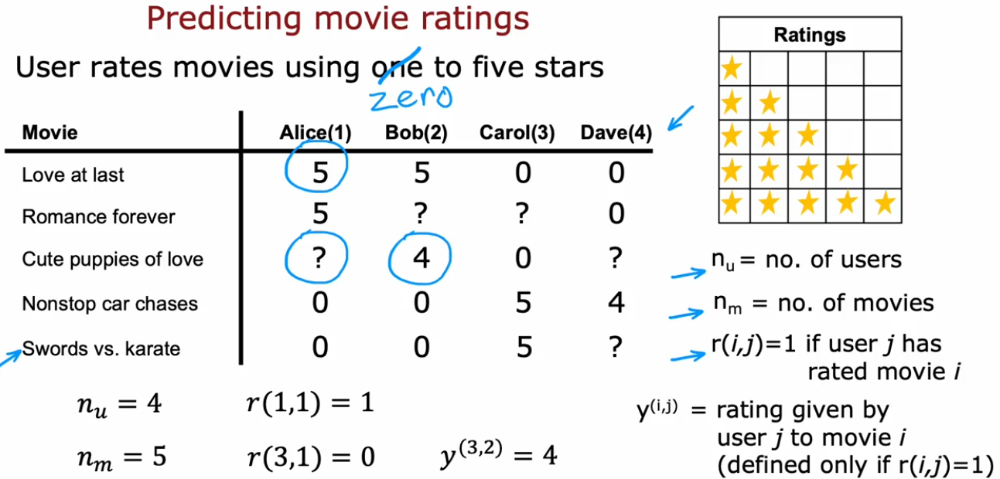
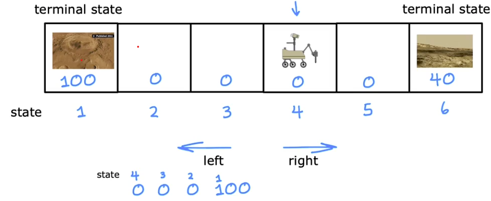
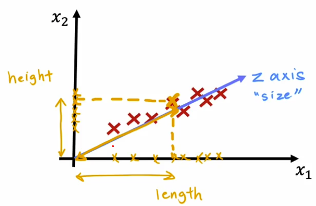
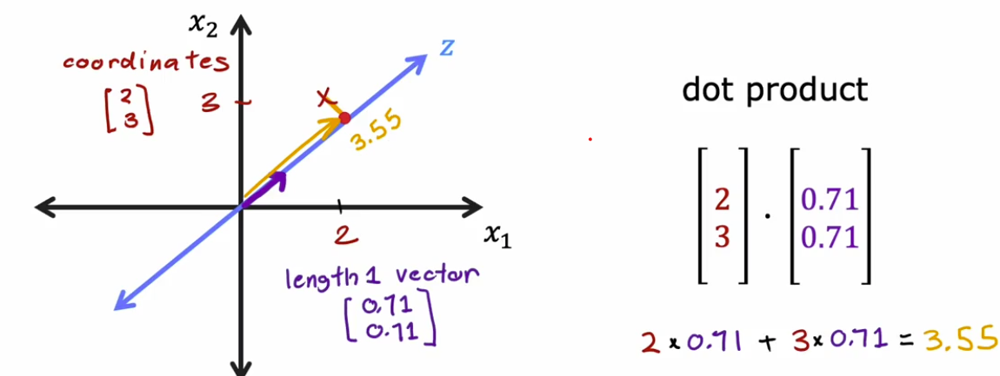

#  🧩 Unsupervised Learning

[← Back to Main Page](../README.md) | [← Back to Overview](../machine_learning.md)

> Find something interesting in unlabeled data

## 📝 Key Concepts

### Data Structure
- No labeled outputs
- Finds patterns in raw data
- Uses input features only

## 🔍 Types of Unsupervised Learning

### 1. [Clustering](clustering/README.MD) 📊
> Groups similar data points together automatically

#### Use Cases
- Google news grouping
- DNA microarray analysis
- Customer segmentation

 

### 2. [Anomaly Detection](anomaly_detection/README.md)
> Identifies rare items, events, or observations which raise suspicions by differing significantly from the majority of the data

#### Use Cases
- Fraud detection in banking
- Network security threat detection
- Fault detection in manufacturing

 

### 3. [Recommender Systems](recommender_systems/README.md)

#### Use case, recommend:
- Movies
- Merchandise
- Restaurants

 

### 4. Reinforcement Learning

$$\text{state }s \longrightarrow \text{action }a  $$

$$ \text{position of helicopter } \longrightarrow \text{how to move control sticks } $$

$\text{reward function}: \\$
$\bullet \text{ positive reward: flying well } +1 \\$
$\bullet \text{ negative reward: crash } - 1000$

 

## Principal Component Analysis
> Reduces number of features for visualization (2 or 3 features)

- Find new axis and coordinates
- Use fewer numbers (ex. capture size from length & height)

 

#### Algorithm:
1. Normalize to have zero mean (feature scaling)
2. Choose an axis (z axis)
3. Project onto z (find axis with highest variance)

#### Coordinate on new axis

 

---
💡 _Unlike supervised learning, there's no "right answer" to check against_