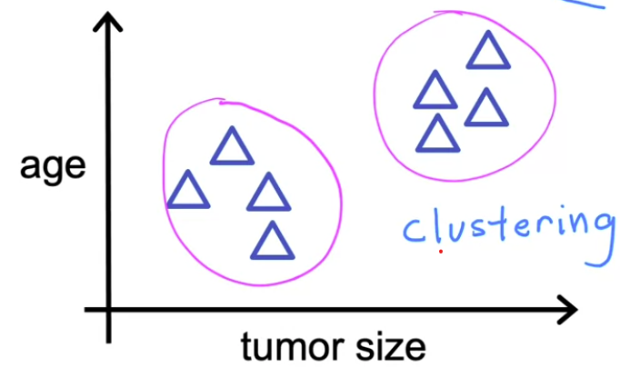

#  🧩 Unsupervised Learning

[← Back to Main Page](../README.md) | [← Back to Overview](../machine_learning.md)

> Find something interesting in unlabeled data

## 📝 Key Concepts

### Data Structure
- No labeled outputs
- Finds patterns in raw data
- Uses input features only

## 🔍 Types of Unsupervised Learning

### 1. [Clustering](clustering/README.MD) 📊
> Groups similar data points together automatically

#### Use Cases
- Google news grouping
- DNA microarray analysis
- Customer segmentation

---
💡 _Unlike supervised learning, there's no "right answer" to check against_